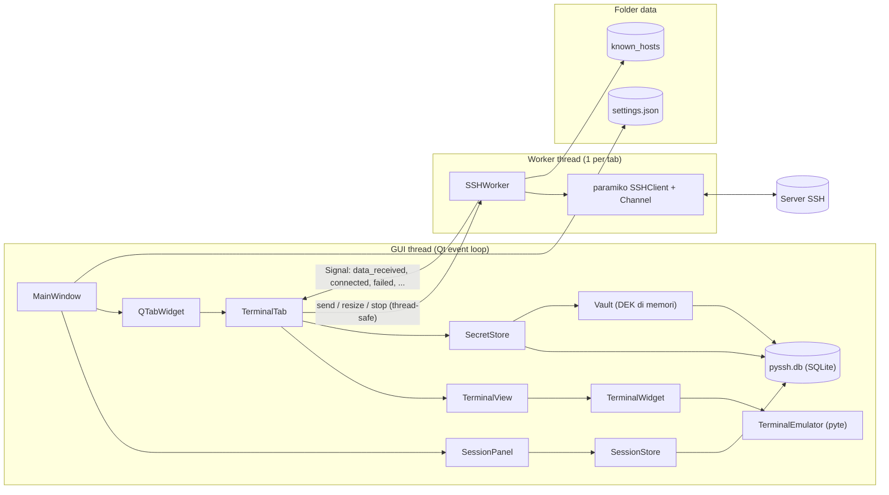
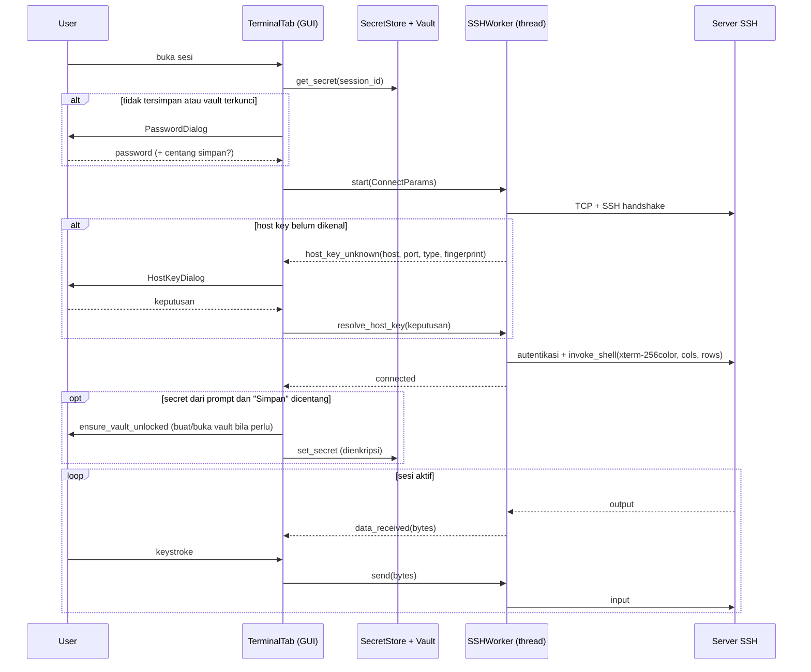
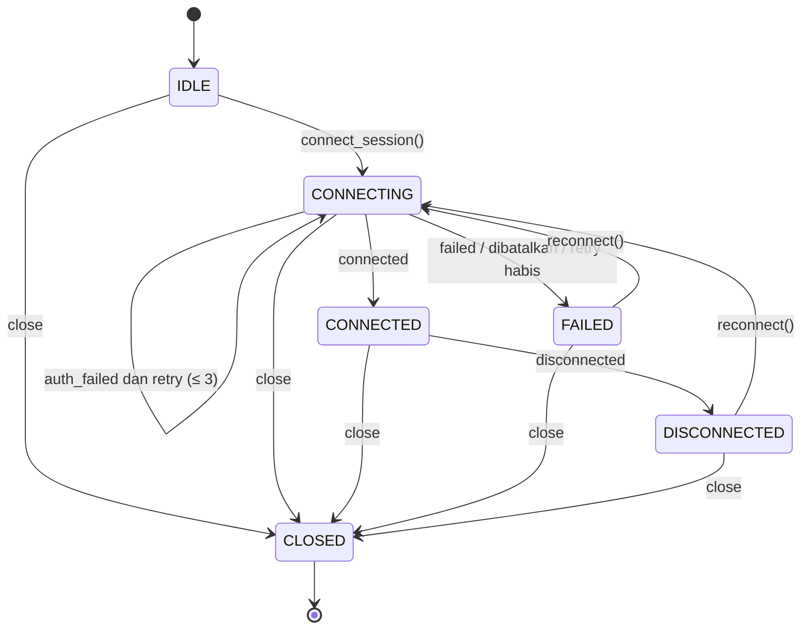
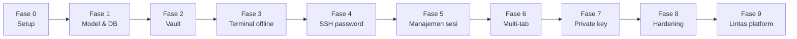

# PySSH — Rancangan Teknis & Workflow Implementasi

| | |
|---|---|
| **Jenis dokumen** | Spesifikasi implementasi untuk agent AI |
| **Versi** | 2.1 — 1 Oktober 2026 (lihat Riwayat Perubahan) |
| **Produk** | Aplikasi desktop SSH client lintas platform, terinspirasi MobaXterm, **hanya fitur sesi SSH** |
| **Platform** | Windows, Linux, macOS — dijalankan langsung dengan Python (tanpa paket `.exe`/installer) |
| **Stack** | Python 3.11+ + PySide6 (Qt 6) + paramiko + pyte + cryptography + sqlite3 (bawaan Python) |

> Simpan dokumen ini di repository sebagai `docs/SPEC.md`. Semua rujukan "§" mengacu ke bagian dokumen ini.
> Agent AI: baca **seluruh** dokumen sebelum menulis kode, lalu ikuti §11 (Workflow) fase demi fase. Prompt awal yang disarankan ada di Lampiran A.

### Riwayat Perubahan

| Versi | Perubahan | Bagian terdampak |
|---|---|---|
| 1.0 | Rilis awal (khusus Windows, `sessions.json` + Windows Credential Manager, paket PyInstaller) | — |
| 1.1 | Waktu penyimpanan secret diperjelas; `is_app_shortcut` dibatasi ke tabel shortcut; pengecualian A1 untuk membuka private key ber-passphrase | §4, §6, §8.3, §9 |
| 2.0 | **Lintas platform** (Windows, Linux, macOS), dijalankan via Python; PyInstaller dan `keyring` dihapus | §1, §3, §6.1, §8, §9, §11 |
| 2.0 | **Penyimpanan diganti SQLite** (`pyssh.db`): daftar sesi + secret; secret dienkripsi AES-256-GCM dengan kunci dari **master password** (scrypt) | §2, §4, §6, §7, §9.3, §10 |
| 2.0 | Shortcut per platform (macOS memakai Cmd) dalam satu tabel sumber `shortcuts.py` | §8.3, §9.8 |
| 2.0 | Fase disusun ulang menjadi 0–9 (Vault = Fase 2; packaging diganti uji lintas platform). Nomor AC/MT berubah | §11 |
| 2.1 | A6 diselaraskan dengan kolom Qt di §5.3; pembagian tugas agent (Linux headless) vs user; opsi server uji `sshd` lokal; `git push`/tag hanya dengan izin; Fase 8–9 disesuaikan | §4, §10, §11.1, §11.11, §11.12, Lampiran A |

> Bila implementasi berdasarkan v1.x sudah berjalan: hapus `core/credentials.py`, kode `sessions.json`, dan dependency `keyring`/`pyinstaller`. Migrasi data **tidak** diperlukan karena belum ada rilis.

---

## Daftar Isi

1. [Ringkasan & Ruang Lingkup](#1-ringkasan--ruang-lingkup)
2. [Kebutuhan](#2-kebutuhan)
3. [Teknologi & Dependency](#3-teknologi--dependency)
4. [Aturan Wajib Arsitektur](#4-aturan-wajib-arsitektur)
5. [Arsitektur](#5-arsitektur)
6. [Model Data, Penyimpanan & Kriptografi](#6-model-data-penyimpanan--kriptografi)
7. [Spesifikasi Modul Core](#7-spesifikasi-modul-core)
8. [Spesifikasi Terminal](#8-spesifikasi-terminal)
9. [Spesifikasi UI](#9-spesifikasi-ui)
10. [Strategi Pengujian](#10-strategi-pengujian)
11. [Workflow Implementasi (Fase 0–9)](#11-workflow-implementasi-fase-09)
12. [Risiko & Mitigasi](#12-risiko--mitigasi)
13. [Pengembangan Lanjutan](#13-pengembangan-lanjutan-di-luar-cakupan-versi-ini)
- [Lampiran A — Prompt Awal untuk Agent](#lampiran-a--prompt-awal-untuk-agent)
- [Lampiran B — Referensi API Library](#lampiran-b--referensi-api-library-yang-dipakai)
- [Lampiran C — Glosarium](#lampiran-c--glosarium)

---

## 1. Ringkasan & Ruang Lingkup

### 1.1 Tujuan

Membangun **PySSH**, aplikasi desktop lintas platform untuk membuka dan mengelola sesi SSH interaktif:

- menyimpan daftar sesi di database SQLite lokal,
- menyimpan password/passphrase secara **terenkripsi**, dibuka dengan satu master password,
- membuka banyak sesi dalam tab,
- autentikasi password atau private key,
- emulasi terminal `xterm-256color` yang layak untuk `htop`, `vim`, `nano`, `less`, dan sejenisnya.

Aplikasi dijalankan dengan `python -m pyssh` (atau perintah `pyssh` setelah `pip install`). Tidak ada paket `.exe`, `.app`, atau installer.

### 1.2 Dalam cakupan

- Daftar sesi tersimpan di SQLite: tambah, ubah, duplikat, hapus, cari.
- **Vault**: master password (buat, buka saat aplikasi dimulai, lewati, ganti, reset bila lupa).
- Password/passphrase tersimpan **opsional**, terenkripsi AES-256-GCM.
- Multi-tab, beberapa koneksi aktif bersamaan.
- Autentikasi password dan private key (format OpenSSH/PEM: Ed25519, ECDSA, RSA), termasuk passphrase.
- Verifikasi host key (Trust On First Use) dengan file `known_hosts` milik aplikasi.
- Emulator terminal: warna 16/256/truecolor, atribut teks, resize PTY, scrollback, seleksi, copy/paste, zoom font.
- Status koneksi, deteksi koneksi putus, reconnect.
- Berjalan di Windows, Linux (X11 & Wayland), dan macOS dengan perilaku keyboard yang sesuai platform.

### 1.3 Di luar cakupan (JANGAN diimplementasikan)

SFTP/file browser, X11 forwarding, RDP/VNC/Telnet/serial, port forwarding/tunnel, jump host/ProxyJump, SSH agent/Pageant, file kunci PuTTY `.ppk` (hanya **dideteksi** lalu diberi pesan), 2FA/OTP interaktif, multi-exec, split pane, macro, logging output sesi ke file, mouse reporting ke aplikasi remote, grup/folder sesi, impor sesi dari PuTTY/MobaXterm, editor tema warna, auto-update, **paket executable/installer**, integrasi keyring OS, auto-lock vault saat idle, sinkronisasi antar perangkat.

### 1.4 Konvensi

- Kode, nama identifier, komentar kode: **bahasa Inggris**. Teks UI: **Bahasa Indonesia**, dipusatkan di `strings.py`.
- Nama aplikasi `PySSH` hanya ditulis di satu konstanta (`config.APP_NAME`) agar mudah diganti.
- **MUST/WAJIB** = tidak boleh dilanggar. **SHOULD** = dikerjakan kecuali ada alasan yang dicatat. **COULD** = opsional.
- Kode byte ditulis dengan notasi Python, contoh `b"\x1b[A"`.
- "Secret" = password SSH atau passphrase private key yang disimpan untuk sebuah sesi. Master password **bukan** secret yang disimpan; ia tidak pernah ditulis ke disk.

---

## 2. Kebutuhan

### 2.1 Kebutuhan fungsional

| ID | Kebutuhan | Prioritas | Fase |
|---|---|---|---|
| F-01 | CRUD sesi (tambah, ubah, duplikat, hapus) di SQLite, persisten antar-restart | MUST | 1, 5 |
| F-02 | Pencarian/filter sesi berdasarkan nama, host, user | SHOULD | 5 |
| F-03 | Login password; simpan opsional (terenkripsi); prompt bila tidak tersimpan/vault terkunci; retry maks. 3× | MUST | 4, 5 |
| F-04 | Login private key (Ed25519/ECDSA/RSA, OpenSSH & PEM) + passphrase (simpan opsional, terenkripsi) | MUST | 7 |
| F-05 | Verifikasi host key TOFU; tolak bila host key berubah; menu "Lupakan Host Key" | MUST | 4, 5 |
| F-06 | Emulasi terminal xterm-256color (warna, atribut, kursor, karakter lebar) | MUST | 3 |
| F-07 | Resize PTY otomatis saat ukuran jendela/font berubah | MUST | 3, 4 |
| F-08 | Scrollback (default 5000 baris, bisa diatur) | MUST | 3 |
| F-09 | Seleksi teks, copy, paste (termasuk bracketed paste) | MUST | 3 |
| F-10 | Multi-tab dengan koneksi independen | MUST | 6 |
| F-11 | Indikator status per tab, deteksi putus, reconnect (tombol dan tombol `R`) | MUST | 4, 6 |
| F-12 | Zoom font (Ctrl/Cmd+wheel dan shortcut) | SHOULD | 3 |
| F-13 | Pengaturan persisten (font, scrollback, geometri jendela, dll.) + dialog pengaturan | SHOULD | 1, 8 |
| F-14 | Log aplikasi berputar (rotating), **tanpa secret** | MUST | 1 |
| F-15 | Mode demo/key inspector (`--demo`) untuk menguji terminal tanpa jaringan | MUST (alat uji) | 3 |
| F-16 | Koneksi ad-hoc dari CLI: `--connect user@host[:port]` | SHOULD | 4 |
| F-17 | Alternate screen (`?1049`) agar layar kembali normal setelah keluar dari vim/htop | SHOULD | 8 |
| F-18 | Vault master password: buat, buka saat start (bisa dilewati), ganti, reset bila lupa | MUST | 2 |
| F-19 | Perilaku keyboard & shortcut sesuai platform (macOS: Cmd untuk aksi aplikasi, Ctrl untuk terminal) | MUST | 3 |
| F-20 | `--version` mencetak versi lalu keluar | SHOULD | 1 |

### 2.2 Kebutuhan non-fungsional (terukur)

| ID | Kategori | Target | Cara ukur |
|---|---|---|---|
| N-01 | Keamanan data | 0 kemunculan secret dalam bentuk **plaintext** di semua file folder data (`pyssh.db`, journal, `settings.json`, `known_hosts`, log) | Test `test_secret_audit` (§10.2) |
| N-02 | Responsivitas | Lag event loop GUI maks. **< 150 ms** selama flood `seq 1 200000` | Log perf (`PYSSH_DEBUG_PERF=1`, §8.4.9) |
| N-03 | Throughput | Output `seq 1 200000` selesai tampil **≤ 10 s** | Stopwatch / log perf |
| N-04 | Interupsi | Ctrl+C saat flood menghentikan output **≤ 2 s** | Manual |
| N-05 | Startup | Sampai jendela utama tampil **≤ 2 s** (tidak termasuk waktu user mengetik master password) | Log `startup_ms` |
| N-06 | CPU idle | **≤ 2 %** total, 5 tab terhubung dan idle (rata-rata 30 s) | Task Manager / `top` / Activity Monitor |
| N-07 | Memori | **≤ 300 MB** RSS, 5 tab, masing-masing setelah `seq 1 10000` | Task Manager / `ps` / Activity Monitor |
| N-08 | Stabilitas | 0 crash/hang saat: tutup tab terhubung, tutup aplikasi dengan 5 sesi aktif, server mati mendadak, 20× connect/disconnect berulang | Test integrasi + manual |
| N-09 | Platform | Windows 10/11; Linux desktop (Ubuntu 22.04+/Fedora 39+, X11 & Wayland); macOS 13+; Python 3.11+. **Uji penuh wajib** di Windows dan Linux; macOS: uji ringkas (MT-9.4) bila perangkat tersedia | Fase 9 |
| N-10 | Kualitas kode | `ruff` 0 error; coverage modul target sesuai fase | Quality Gate §11.2 |
| N-11 | Kriptografi | AES-256-GCM, nonce acak 96-bit per enkripsi, AAD terikat `session_id`; KDF scrypt (N=2¹⁷, r=8, p=1); waktu buka vault **0,2–2,0 s** di mesin dev | Test `test_crypto`/`test_vault` + log `unlock_ms` |

---

## 3. Teknologi & Dependency

| Komponen | Versi minimum | Fungsi |
|---|---|---|
| Python | 3.11 (disarankan 3.12) | Runtime (`StrEnum` butuh 3.11) |
| PySide6 | 6.7 | GUI (Qt 6, lisensi LGPL) |
| paramiko | 3.4 | Protokol SSH (wajib ≥ 3.2 untuk `PKey.from_path`) |
| pyte | 0.8.2 | Parser escape sequence VT100/xterm |
| cryptography | 42.0 | scrypt + AES-256-GCM (juga dependency paramiko; dideklarasikan eksplisit karena dipakai langsung) |
| sqlite3 | bawaan Python | Database lokal |
| pytest | 8.0 | Test runner (dev) |
| pytest-qt | 4.4 | Test widget Qt (dev) |
| pytest-cov | 5.0 | Coverage (dev) |
| ruff | 0.6 | Lint + formatter (dev) |

`bcrypt`, `pynacl`, `wcwidth` ikut terpasang sebagai dependency transitif. **Jangan menambah dependency lain** tanpa mencatat alasannya di laporan fase.

**Prasyarat sistem Linux** (Qt plugin xcb):

- Debian/Ubuntu: `sudo apt install python3-venv libxcb-cursor0` (ganti `python3-venv` dengan `python3.12-venv` bila memakai Python 3.12 dari deadsnakes).
- Fedora: `sudo dnf install xcb-util-cursor`.

### 3.1 `pyproject.toml` (acuan)

```toml
[build-system]
requires = ["setuptools>=69", "wheel"]
build-backend = "setuptools.build_meta"

[project]
name = "pyssh"
version = "0.1.0"
requires-python = ">=3.11"
dependencies = [
  "PySide6>=6.7",
  "paramiko>=3.4",
  "pyte>=0.8.2",
  "cryptography>=42.0",
]

[project.optional-dependencies]
dev = [
  "pytest>=8.0",
  "pytest-qt>=4.4",
  "pytest-cov>=5.0",
  "ruff>=0.6",
]

[project.gui-scripts]
pyssh = "pyssh.app:main"

[tool.setuptools.packages.find]
where = ["src"]

[tool.setuptools.package-data]
pyssh = ["resources/*"]

[tool.ruff]
line-length = 100
target-version = "py311"
src = ["src", "tests"]

[tool.ruff.lint]
select = ["E", "F", "W", "I", "B", "UP", "SIM", "RUF"]

[tool.pytest.ini_options]
testpaths = ["tests"]
qt_api = "pyside6"
markers = ["integration: butuh server SSH uji (lihat §10.3)"]
```

---

## 4. Aturan Wajib Arsitektur

| ID | Aturan (MUST) |
|---|---|
| A1 | GUI thread **tidak boleh** melakukan I/O jaringan atau operasi blocking > 50 ms. Semua panggilan jaringan paramiko berjalan di worker thread. **Pengecualian yang diterima (v0.1)**, selalu dengan kursor tunggu: (a) `load_private_key()` untuk key ber-passphrase; (b) derivasi kunci scrypt saat membuat, membuka, atau mengganti master password. |
| A2 | `TerminalEmulator` (pyte) dan koneksi SQLite **hanya** diakses dari GUI thread. Worker hanya mengirim `bytes` lewat Signal. |
| A3 | Satu worker thread per koneksi (`threading.Thread(daemon=True)`). Worker → GUI: Qt `Signal`. GUI → worker: method thread-safe (`queue.Queue`, `threading.Event`, `threading.Lock`). |
| A4 | Objek `SSHWorker` (QObject) **tidak boleh** diberi parent Qt. Referensinya dipegang `TerminalTab` dan target thread-nya sendiri. |
| A5 | Secret, master password, dan kunci (KEK/DEK) hanya hidup di memori. Dilarang muncul di disk dalam bentuk plaintext, di log, di pesan exception yang ditampilkan, atau di `repr()` (gunakan `field(repr=False)`). Di database, secret hanya tersimpan sebagai ciphertext. |
| A6 | Batas impor Qt mengikuti kolom "Boleh impor Qt?" di §5.3 (mengikat, diperiksa `test_architecture.py`): (a) **tanpa PySide6 sama sekali**: `config.py`, `models.py`, semua modul `core/` **kecuali** `ssh_worker.py` (termasuk `settings_store`, `key_loader`, `known_hosts`, `errors`), `terminal/emulator.py`, `terminal/colors.py`; (b) **hanya `PySide6.QtCore`**: `core/ssh_worker.py`, `shortcuts.py`, `terminal/keymap.py`; (c) modul lain di `terminal/`, `ui/`, dan `app.py` bebas. |
| A7 | Semua path data diambil dari `config.get_paths()`; mendukung override env `PYSSH_HOME` (wajib untuk isolasi test). Tidak ada path yang di-hardcode per OS di luar `config.py`. |
| A8 | Semua teks yang terlihat user ada di `pyssh/strings.py`. |
| A9 | Penulisan data: SQLite memakai transaksi (`with conn:`); file JSON ditulis **atomic** (tulis `.tmp` → `flush` → `os.fsync` → `os.replace`). |
| A10 | Setiap modul memakai `from __future__ import annotations`, type hints pada semua fungsi publik, dan docstring singkat. |
| A11 | Tidak ada `print()` di kode aplikasi (kecuali output `--version`); gunakan `logging.getLogger(__name__)`. |
| A12 | Kode khusus platform hanya melalui konstanta di `config.py` (`IS_WINDOWS`, `IS_MAC`, `IS_LINUX`) dan parameter yang bisa diinjeksi di test (contoh `mac: bool = IS_MAC`). Jangan memanggil `sys.platform` langsung di modul lain. |
| A13 | Kriptografi hanya memakai primitif `cryptography` yang ditentukan di §6.5. Dilarang membuat algoritma sendiri, memakai ulang nonce, atau menyimpan kunci di disk. |

---

## 5. Arsitektur

### 5.1 Diagram komponen



### 5.2 Struktur direktori

```
pyssh/
├── pyproject.toml
├── README.md
├── CHANGELOG.md
├── .gitignore
├── docs/
│   ├── SPEC.md                    # dokumen ini
│   └── PROGRESS.md                # laporan per fase (§11.13)
├── tools/
│   ├── make_ansi_demo.py          # generator resources/ansi_demo.txt
│   ├── make_icon.py               # generator resources/icon.png (pakai QPainter)
│   └── bench_emulator.py          # benchmark throughput pyte
├── src/pyssh/
│   ├── __init__.py                # __version__ = "0.1.0"
│   ├── __main__.py                # sys.exit(main())
│   ├── app.py                     # main(): argparse, logging, QApplication, DB, vault, jendela
│   ├── config.py                  # APP_NAME, IS_*, AppPaths, get_paths(), ensure_dirs()
│   ├── models.py                  # AuthType, SessionConfig, AppSettings
│   ├── strings.py                 # semua teks UI
│   ├── shortcuts.py               # tabel shortcut per platform + is_app_shortcut()
│   ├── services.py                # AppServices (dependency container)
│   ├── logging_setup.py           # setup_logging()
│   ├── resources/
│   │   ├── ansi_demo.txt
│   │   └── icon.png
│   ├── core/
│   │   ├── __init__.py
│   │   ├── database.py            # koneksi SQLite, skema, versi skema
│   │   ├── session_store.py       # CRUD tabel sessions
│   │   ├── crypto.py              # scrypt + AES-256-GCM (fungsi murni)
│   │   ├── vault.py               # master password, DEK, state vault
│   │   ├── secret_store.py        # secret terenkripsi per sesi
│   │   ├── settings_store.py
│   │   ├── key_loader.py
│   │   ├── known_hosts.py
│   │   ├── errors.py
│   │   └── ssh_worker.py
│   ├── terminal/
│   │   ├── __init__.py
│   │   ├── emulator.py            # TerminalEmulator (wrapper pyte)
│   │   ├── colors.py              # Theme, resolve_color()
│   │   ├── keymap.py              # key_to_bytes()
│   │   ├── widget.py              # TerminalWidget (render + input)
│   │   ├── view.py                # TerminalView = widget + scrollbar
│   │   └── demo_backend.py        # backend lokal untuk --demo
│   └── ui/
│       ├── __init__.py
│       ├── main_window.py
│       ├── session_panel.py
│       ├── session_dialog.py
│       ├── terminal_tab.py
│       ├── dialogs.py             # PasswordDialog, HostKeyDialog, helper konfirmasi
│       ├── vault_dialogs.py       # buat/buka/ganti/reset master password, ensure_vault_unlocked()
│       ├── settings_dialog.py     # Fase 8
│       └── icons.py               # ikon titik status (digambar QPainter)
└── tests/
    ├── conftest.py                # PYSSH_HOME ke tmp, KDF cepat, offscreen di Linux headless
    ├── fakes.py                   # FakeWorker
    ├── test_smoke.py
    ├── test_architecture.py
    ├── test_config.py
    ├── test_models.py
    ├── test_database.py
    ├── test_session_store.py
    ├── test_settings_store.py
    ├── test_crypto.py
    ├── test_vault.py
    ├── test_secret_store.py
    ├── test_vault_dialogs.py
    ├── test_key_loader.py
    ├── test_known_hosts.py
    ├── test_errors.py
    ├── test_shortcuts.py
    ├── test_colors.py
    ├── test_keymap.py
    ├── test_emulator.py
    ├── test_widget.py
    ├── test_session_dialog.py
    ├── test_session_panel.py
    ├── test_terminal_tab.py
    ├── test_main_window.py
    └── integration/
        ├── conftest.py            # baca env PYSSH_TEST_*, skip bila server tidak ada
        ├── test_ssh_password.py
        ├── test_ssh_key.py
        ├── test_multi_tab.py
        └── test_secret_audit.py
```

### 5.3 Tanggung jawab modul

| Modul | Tanggung jawab | Boleh impor Qt? |
|---|---|---|
| `config.py` | Konstanta aplikasi & platform, lokasi folder data per OS | Tidak |
| `models.py` | Dataclass `SessionConfig`, `AppSettings`, enum `AuthType` | Tidak |
| `shortcuts.py` | Tabel shortcut per platform, `is_app_shortcut()` | QtCore saja (enum) |
| `core/database.py` | Membuka SQLite, PRAGMA, membuat/memeriksa skema, menangani file rusak | Tidak |
| `core/session_store.py` | CRUD tabel `sessions` | Tidak |
| `core/crypto.py` | `derive_key`, `encrypt`, `decrypt` (fungsi murni) | Tidak |
| `core/vault.py` | State vault, master password, membungkus/membuka DEK | Tidak |
| `core/secret_store.py` | Simpan/ambil secret terenkripsi per sesi | Tidak |
| `core/settings_store.py` | Baca/tulis `settings.json`, default & clamp | Tidak |
| `core/key_loader.py` | Memuat private key, deteksi `.ppk` dan passphrase | Tidak |
| `core/known_hosts.py` | Fingerprint, nama entri, hapus entri host | Tidak |
| `core/errors.py` | Memetakan exception → kode + pesan user | Tidak |
| `core/ssh_worker.py` | Koneksi SSH di thread, I/O loop, host-key prompt | QtCore saja |
| `terminal/emulator.py` | Wrapper pyte: feed, resize, scrollback, mode | Tidak |
| `terminal/colors.py` | Palet & resolusi warna pyte → hex | Tidak |
| `terminal/keymap.py` | Tombol Qt → bytes | QtCore saja (enum) |
| `terminal/widget.py` | Render grid, keyboard, mouse, clipboard, resize, pump data | Ya |
| `terminal/view.py` | Gabungan `TerminalWidget` + `QScrollBar` | Ya |
| `ui/terminal_tab.py` | State machine koneksi, alur kredensial, banner | Ya |
| `ui/vault_dialogs.py` | Dialog vault dan `ensure_vault_unlocked()` | Ya |
| `ui/*` lainnya | Jendela utama, panel sesi, dialog | Ya |

### 5.4 Model thread

- **GUI thread**: semua widget, `TerminalEmulator`, dialog, koneksi SQLite (operasi lokal dan cepat), vault.
- **Worker thread** (per tab): `SSHClient.connect`, `invoke_shell`, loop baca/tulis channel.
- Signal yang dipancarkan dari worker thread otomatis menjadi *queued connection* karena receiver hidup di GUI thread.
- Data keluar (keystroke) masuk `queue.Queue` milik worker; worker mengurasnya tiap iterasi loop (maks. 20 ms).

### 5.5 Alur koneksi



---

## 6. Model Data, Penyimpanan & Kriptografi

### 6.1 Lokasi file

Root data (urutan prioritas):

| Kondisi | Root |
|---|---|
| Env `PYSSH_HOME` diset | `$PYSSH_HOME` |
| Windows | `%APPDATA%\PySSH` |
| macOS | `~/Library/Application Support/PySSH` |
| Linux / POSIX lain | `$XDG_DATA_HOME/pyssh`, atau `~/.local/share/pyssh` bila `XDG_DATA_HOME` kosong |

| File | Isi |
|---|---|
| `<root>/pyssh.db` | Database SQLite: sesi, vault, secret terenkripsi |
| `<root>/settings.json` | Pengaturan aplikasi (tidak sensitif) |
| `<root>/known_hosts` | Host key terpercaya (format OpenSSH) |
| `<root>/logs/pyssh.log` | Log berputar 1 MB × 3 file |

Di POSIX (Linux/macOS): folder root dan `logs/` dibuat dengan mode `0o700`; `pyssh.db`, `settings.json`, `known_hosts` di-`chmod` `0o600` setelah dibuat. Di Windows, izin bawaan profil user dipakai apa adanya.

### 6.2 `SessionConfig`

```python
from __future__ import annotations

import uuid
from dataclasses import dataclass, field
from datetime import datetime
from enum import StrEnum


class AuthType(StrEnum):
    PASSWORD = "password"
    KEY = "key"


def now_iso() -> str:
    return datetime.now().astimezone().isoformat(timespec="seconds")


@dataclass
class SessionConfig:
    name: str                      # 1–64 karakter, unik (case-insensitive)
    host: str                      # hostname / IPv4 / IPv6 (tanpa bracket)
    username: str                  # tidak kosong, tanpa spasi
    port: int = 22                 # 1–65535
    auth_type: AuthType = AuthType.PASSWORD
    key_path: str | None = None    # wajib bila auth_type == KEY
    remember_secret: bool = False  # True = secret disimpan (terenkripsi) di tabel secrets
    id: str = field(default_factory=lambda: uuid.uuid4().hex)
    created_at: str = field(default_factory=now_iso)
    last_used_at: str | None = None

    def validate(self) -> None: ...            # ValueError dengan pesan dari strings.py
    def target(self) -> str:                   # "user@host:port"
        return f"{self.username}@{self.host}:{self.port}"
```

`SessionConfig` **tidak** memiliki field secret. Secret selalu lewat `SecretStore`.

### 6.3 Skema database (`pyssh.db`)

```sql
-- Dijalankan setiap kali koneksi dibuka
PRAGMA foreign_keys = ON;
PRAGMA secure_delete = ON;       -- data yang dihapus ditimpa nol di file

-- Skema versi 1: dibuat bila PRAGMA user_version = 0, lalu PRAGMA user_version = 1
CREATE TABLE sessions (
    id              TEXT PRIMARY KEY,                       -- uuid4 hex
    name            TEXT NOT NULL,
    name_key        TEXT NOT NULL UNIQUE,                   -- name.casefold(), untuk keunikan
    host            TEXT NOT NULL,
    port            INTEGER NOT NULL CHECK (port BETWEEN 1 AND 65535),
    username        TEXT NOT NULL,
    auth_type       TEXT NOT NULL CHECK (auth_type IN ('password', 'key')),
    key_path        TEXT,
    remember_secret INTEGER NOT NULL DEFAULT 0 CHECK (remember_secret IN (0, 1)),
    created_at      TEXT NOT NULL,
    last_used_at    TEXT
);

CREATE TABLE vault (
    id          INTEGER PRIMARY KEY CHECK (id = 1),         -- maksimal satu baris
    kdf         TEXT    NOT NULL,                           -- 'scrypt'
    kdf_salt    BLOB    NOT NULL,                           -- 16 byte acak
    kdf_n       INTEGER NOT NULL,
    kdf_r       INTEGER NOT NULL,
    kdf_p       INTEGER NOT NULL,
    dek_nonce   BLOB    NOT NULL,                           -- 12 byte
    dek_wrapped BLOB    NOT NULL,                           -- DEK terenkripsi (32 byte + tag 16 byte)
    created_at  TEXT    NOT NULL,
    updated_at  TEXT    NOT NULL
);

CREATE TABLE secrets (
    session_id  TEXT PRIMARY KEY REFERENCES sessions(id) ON DELETE CASCADE,
    nonce       BLOB NOT NULL,                              -- 12 byte, baru setiap enkripsi
    ciphertext  BLOB NOT NULL,                              -- AES-256-GCM (termasuk tag 16 byte)
    updated_at  TEXT NOT NULL
);
```

Aturan:

- File tidak ada → dibuat dengan skema terbaru.
- File rusak (`sqlite3.DatabaseError` saat membuka, atau `PRAGMA quick_check` ≠ `ok`) → tutup, rename ke `pyssh.db.corrupt-YYYYmmdd-HHMMSS`, buat database baru, kembalikan pesan peringatan (ditampilkan sekali di UI).
- `user_version` > versi skema yang dikenal → raise `DatabaseVersionError`; aplikasi menampilkan pesan "Database dibuat oleh versi PySSH yang lebih baru" lalu keluar dengan kode 2 **tanpa mengubah file**.
- Perubahan skema berikutnya dilakukan lewat fungsi migrasi berurutan (`_migrate_1_to_2`, dst.) di `database.py`.
- Menjalankan dua instance aplikasi bersamaan tidak didukung resmi (SQLite tetap aman berkat locking; `timeout=5`).

### 6.4 `AppSettings` dan `settings.json`

```python
@dataclass
class AppSettings:
    font_family: str = ""                # "" = otomatis sesuai platform (§8.4.2)
    font_size: int = 11                  # clamp 6–32 (default macOS: 12)
    scrollback_lines: int = 5000         # clamp 100–100000
    copy_on_select: bool = True
    bold_is_bright: bool = True
    confirm_on_close: bool = True
    keepalive_seconds: int = 30          # clamp 0–600 (0 = nonaktif)
    connect_timeout_seconds: int = 10    # clamp 3–120
    mac_option_as_meta: bool = False     # macOS: Option+huruf dikirim sebagai ESC+huruf
    window_geometry: str | None = None   # base64 dari QMainWindow.saveGeometry()
    window_state: str | None = None      # base64 dari QMainWindow.saveState()
    splitter_state: str | None = None    # base64 dari QSplitter.saveState()
```

`settings.json` berisi `{"version": 1, "settings": {...}}`. Key yang hilang memakai default, nilai di luar rentang di-clamp, tipe salah memakai default (dicatat di log). JSON rusak → rename ke `settings.json.corrupt-…` dan pakai default.

### 6.5 Desain kriptografi (vault)

```
master password ─NFC─▶ UTF-8 ─▶ scrypt(salt 16 B, N=2^17, r=8, p=1) ─▶ KEK (32 B, hanya di memori)

KEK ─AES-256-GCM─▶ membuka dek_wrapped (nonce = dek_nonce, AAD = b"pyssh/dek/v1") ─▶ DEK (32 B acak)

DEK ─AES-256-GCM─▶ secret (nonce acak 12 B, AAD = b"pyssh/secret/v1/" + session_id) ─▶ secrets.ciphertext
```

| Elemen | Keputusan |
|---|---|
| KDF | `cryptography.hazmat.primitives.kdf.scrypt.Scrypt`, panjang 32 byte. Parameter disimpan di tabel `vault` agar bisa dinaikkan nanti. Default `N=2**17, r=8, p=1` (≈128 MiB RAM). Bila gagal karena batas memori atau `unlock_ms` > 2000 di mesin dev, turunkan ke `N=2**16` dan catat di laporan. |
| Normalisasi | `unicodedata.normalize("NFC", master_password).encode("utf-8")` — agar karakter non-ASCII konsisten antar OS (macOS cenderung NFD). |
| Cipher | `cryptography.hazmat.primitives.ciphers.aead.AESGCM` dengan kunci 256-bit. |
| Nonce | `os.urandom(12)` setiap enkripsi. Tidak pernah dipakai ulang. |
| Hierarki kunci | Master password → KEK → membuka DEK; DEK mengenkripsi semua secret. Ganti master password cukup membungkus ulang DEK (baris `secrets` tidak berubah). |
| Verifikasi master password | Tidak ada hash verifier terpisah. Master password salah → `InvalidTag` saat membuka DEK → `unlock()` mengembalikan `False`. |
| AAD | Mengikat ciphertext ke `session_id`; ciphertext yang disalin ke baris sesi lain gagal didekripsi. |
| Data di memori | DEK disimpan sebagai `bytes` selama state UNLOCKED; `lock()` membuang referensinya. KEK dan master password tidak disimpan setelah dipakai. Python tidak bisa menjamin penghapusan memori; ini batasan yang diterima. |
| Tidak dienkripsi (disengaja) | Metadata sesi (nama, host, port, username, path key), `settings.json`, `known_hosts`. File private key **tidak** disalin ke database; hanya path-nya. |

**State vault**

| State | Arti | Secret bisa dibaca? | Secret bisa disimpan? |
|---|---|---|---|
| `UNINITIALIZED` | Belum ada baris di tabel `vault` | — | Tidak (harus membuat master password dulu) |
| `LOCKED` | Vault ada, master password belum dimasukkan (dilewati) | Tidak (`get_secret` → `None`) | Tidak (harus membuka dulu) |
| `UNLOCKED` | DEK ada di memori | Ya | Ya |

### 6.6 Kapan secret ditulis ke database

- **Dari `SessionDialog`** (field secret diisi dan "Simpan" dicentang): langsung disimpan saat dialog disimpan (§9.5), setelah `ensure_vault_unlocked()` berhasil.
- **Dari `PasswordDialog` saat connect** (secret belum tersimpan, vault terkunci, atau prompt ulang setelah gagal): disimpan **hanya setelah koneksi berhasil** (§9.6.3 langkah 5), agar password salah dari prompt tidak tersimpan.
- Bila secret tersimpan ternyata salah, lalu prompt ulang berhasil dengan "Simpan" dicentang, secret lama **diganti**.
- `ensure_vault_unlocked()` gagal/dibatalkan → secret tidak disimpan, sesi tetap tersimpan dengan `remember_secret = False`, user diberi tahu.

### 6.7 `known_hosts`

- Format OpenSSH standar, dikelola `paramiko.SSHClient.load_host_keys()` / `save_host_keys()`.
- Nama entri: `host` bila port 22, `[host]:port` bila bukan 22 (paramiko melakukan ini otomatis).
- Penulisan dilindungi `threading.Lock` tingkat modul (`_KNOWN_HOSTS_LOCK`) karena beberapa tab bisa menyimpan bersamaan.

### 6.8 Logging

- `RotatingFileHandler(log_file, maxBytes=1_000_000, backupCount=3, encoding="utf-8")`.
- Format: `%(asctime)s %(levelname)s [%(threadName)s] %(name)s: %(message)s`.
- Level default INFO; `--debug` → DEBUG. Logger `paramiko` diset WARNING (DEBUG bila `--debug`).
- `sys.excepthook` dan `threading.excepthook` mencatat exception tak tertangani; untuk GUI thread juga tampilkan `QMessageBox.critical` berisi ringkasan (bukan traceback).
- **Dilarang** mencatat: secret, master password, kunci, ciphertext, isi `ConnectParams.password`, atau data terminal mentah (`data_received`).
- Yang boleh dicatat: event vault (`vault initialized`, `vault unlocked unlock_ms=…`, `vault unlock failed`), host:port, username, kode error.

---

## 7. Spesifikasi Modul Core

### 7.1 `config.py`

```python
APP_NAME = "PySSH"
APP_ORG = "PySSH"
IS_WINDOWS = sys.platform == "win32"
IS_MAC = sys.platform == "darwin"
IS_LINUX = sys.platform.startswith("linux")

@dataclass(frozen=True)
class AppPaths:
    root: Path
    db_file: Path            # root / "pyssh.db"
    settings_file: Path      # root / "settings.json"
    known_hosts_file: Path   # root / "known_hosts"
    log_dir: Path            # root / "logs"
    log_file: Path           # root / "logs" / "pyssh.log"

def get_paths(*, platform: str = sys.platform, env: Mapping[str, str] = os.environ,
              home: Path | None = None) -> AppPaths: ...   # parameter untuk test (§6.1)
def ensure_dirs(paths: AppPaths) -> None: ...                # mode 0o700 di POSIX
def restrict_file(path: Path) -> None: ...                   # chmod 0o600 di POSIX, no-op di Windows
```

### 7.2 `core/database.py`

```python
SCHEMA_VERSION = 1

class DatabaseVersionError(Exception): ...

class Database:
    def __init__(self, path: Path) -> None: ...
    def open(self) -> str | None: ...
        # buka/buat, PRAGMA, quick_check, buat skema bila user_version == 0;
        # return pesan peringatan bila file rusak sudah dipindahkan, selain itu None
    @property
    def conn(self) -> sqlite3.Connection: ...
    def close(self) -> None: ...
```

- `sqlite3.connect(path, timeout=5)`; `conn.row_factory = sqlite3.Row`.
- Setelah file dibuat: `config.restrict_file(path)`.
- Semua mutasi di modul lain memakai `with db.conn:` (commit/rollback otomatis).

### 7.3 `core/session_store.py`

```python
class SessionStore:
    def __init__(self, db: Database) -> None: ...
    def all(self) -> list[SessionConfig]: ...           # urut name_key
    def get(self, session_id: str) -> SessionConfig | None: ...
    def add(self, session: SessionConfig) -> None: ...  # validate(); ValueError bila nama duplikat
    def update(self, session: SessionConfig) -> None: ...  # KeyError bila id tak ada; cek nama unik
    def delete(self, session_id: str) -> None: ...      # secret ikut terhapus (ON DELETE CASCADE)
    def duplicate(self, session_id: str) -> SessionConfig: ...
        # id baru, nama "<nama> (salinan)" (tambah angka bila bentrok),
        # remember_secret=False, secret TIDAK disalin
    def touch(self, session_id: str) -> None: ...       # set last_used_at = sekarang
    def set_remember(self, session_id: str, remember: bool) -> None: ...
```

- Pelanggaran `UNIQUE(name_key)` (`sqlite3.IntegrityError`) diterjemahkan menjadi `ValueError` dengan pesan dari `strings.py`.
- Baris yang gagal dikonversi ke `SessionConfig` dilewati dan dicatat di log (WARNING).

### 7.4 `core/crypto.py`

```python
@dataclass(frozen=True)
class KdfParams:
    n: int = 2**17
    r: int = 8
    p: int = 1

DEFAULT_KDF = KdfParams()
KEY_LEN = 32
NONCE_LEN = 12
SALT_LEN = 16

class DecryptError(Exception): ...

def derive_key(password: str, salt: bytes, params: KdfParams) -> bytes: ...
    # NFC → UTF-8 → Scrypt(salt, KEY_LEN, n, r, p).derive(...)
def new_salt() -> bytes: ...          # os.urandom(SALT_LEN)
def new_key() -> bytes: ...           # os.urandom(KEY_LEN)
def encrypt(key: bytes, plaintext: bytes, aad: bytes) -> tuple[bytes, bytes]: ...
    # nonce = os.urandom(NONCE_LEN); return (nonce, AESGCM(key).encrypt(nonce, plaintext, aad))
def decrypt(key: bytes, nonce: bytes, ciphertext: bytes, aad: bytes) -> bytes: ...
    # InvalidTag / ValueError → DecryptError
```

### 7.5 `core/vault.py`

```python
MIN_MASTER_PASSWORD_LEN = 8

class VaultState(Enum):
    UNINITIALIZED = "uninitialized"
    LOCKED = "locked"
    UNLOCKED = "unlocked"

class VaultLocked(Exception): ...

class Vault:
    def __init__(self, db: Database, kdf: KdfParams = DEFAULT_KDF) -> None: ...
        # state awal: UNINITIALIZED bila tabel vault kosong, selain itu LOCKED
    @property
    def state(self) -> VaultState: ...
    def initialize(self, master_password: str) -> None: ...
        # ValueError bila sudah ada vault atau password < MIN; buat DEK, bungkus, simpan; state → UNLOCKED
    def unlock(self, master_password: str) -> bool: ...
        # pakai parameter KDF dari tabel vault (bukan self._kdf); False bila salah; log unlock_ms
    def lock(self) -> None: ...
    def change_master_password(self, old: str, new: str) -> bool: ...
        # False bila old salah; salt baru, KDF default terbaru, bungkus ulang DEK dalam satu transaksi
    def reset(self) -> None: ...
        # satu transaksi: DELETE FROM secrets; DELETE FROM vault; UPDATE sessions SET remember_secret = 0
        # state → UNINITIALIZED
    def encrypt_secret(self, session_id: str, secret: str) -> tuple[bytes, bytes]: ...  # VaultLocked
    def decrypt_secret(self, session_id: str, nonce: bytes, ciphertext: bytes) -> str: ...  # VaultLocked / DecryptError
```

### 7.6 `core/secret_store.py`

```python
class SecretStore:
    def __init__(self, db: Database, vault: Vault) -> None: ...
    @property
    def can_store(self) -> bool: ...                      # vault.state == UNLOCKED
    def get_secret(self, session_id: str) -> str | None: ...
        # None bila tidak ada, vault tidak UNLOCKED, atau DecryptError (log WARNING tanpa isi)
    def set_secret(self, session_id: str, secret: str) -> None: ...
        # VaultLocked bila tidak UNLOCKED; INSERT OR REPLACE; set sessions.remember_secret = 1
    def delete_secret(self, session_id: str) -> None: ...   # boleh walau terkunci; tidak error bila tidak ada
    def has_secret(self, session_id: str) -> bool: ...      # boleh walau terkunci
```

### 7.7 `core/settings_store.py`

```python
class SettingsStore:
    def __init__(self, path: Path) -> None: ...
    def load(self) -> AppSettings: ...
    def save(self, settings: AppSettings) -> None: ...   # atomic (A9), lalu restrict_file
    @property
    def current(self) -> AppSettings: ...
```

### 7.8 `core/key_loader.py`

```python
class KeyLoadError(Exception):
    def __init__(self, code: str, message: str) -> None: ...

class PassphraseRequired(Exception): ...

def load_private_key(path: str, passphrase: str | None = None) -> paramiko.PKey: ...
```

Algoritma:

1. Ekspansi `~` (`os.path.expanduser`). File tidak ada → `KeyLoadError("KEY_NOT_FOUND")`.
2. Baca 64 byte pertama; bila diawali `b"PuTTY-User-Key-File"` → `KeyLoadError("KEY_PPK_UNSUPPORTED")` dengan instruksi konversi: *PuTTYgen → Load → Conversions → Export OpenSSH key*, atau `puttygen key.ppk -O private-openssh -o id_key` di Linux/macOS.
3. `paramiko.PKey.from_path(path, passphrase=passphrase)`.
4. `paramiko.PasswordRequiredException`: bila `passphrase is None` → `PassphraseRequired`; bila tidak → `KeyLoadError("KEY_BAD_PASSPHRASE")`.
5. `paramiko.pkey.UnknownKeyType` → `KeyLoadError("KEY_UNSUPPORTED_TYPE")`.
6. `paramiko.SSHException` / `ValueError` lain: bila passphrase diberikan → `KEY_BAD_PASSPHRASE`, bila tidak → `KEY_INVALID`.

> Perilaku exception paramiko untuk passphrase salah bisa berbeda antar format; **wajib** dibuktikan lewat `test_key_loader.py` dengan key nyata (§10.2).

### 7.9 `core/known_hosts.py`

```python
def ensure_file(path: Path) -> None: ...                 # buat file kosong bila belum ada + restrict_file
def fingerprint_sha256(key: paramiko.PKey) -> str: ...
    # "SHA256:" + base64(sha256(key.asbytes())).rstrip("=")  (sama dengan OpenSSH)
def entry_name(host: str, port: int) -> str: ...          # "host" atau "[host]:port"
def forget_host(path: Path, host: str, port: int) -> bool: ...
    # hapus entri entry_name(host, port); True bila ada yang dihapus; pakai _KNOWN_HOSTS_LOCK
```

### 7.10 `core/errors.py`

```python
@dataclass(frozen=True)
class UserError:
    code: str
    message: str

class HostKeyRejected(Exception): ...   # user menolak host key

def describe_error(exc: BaseException, *, host: str, port: int,
                   username: str, timeout: int) -> UserError: ...
```

Urutan pengecekan **wajib** dari yang paling spesifik (karena hierarki kelas tumpang tindih):

| Urutan | Exception | Kode | Pesan (contoh, isi di `strings.py`) |
|---|---|---|---|
| 1 | `HostKeyRejected` | `E_HOSTKEY_REJECTED` | Koneksi dibatalkan: host key tidak diterima. |
| 2 | `paramiko.BadHostKeyException` | `E_HOSTKEY_CHANGED` | PERINGATAN: host key {host}:{port} berubah! Kemungkinan serangan man-in-the-middle, atau server diinstal ulang. |
| 3 | `paramiko.AuthenticationException` (termasuk `BadAuthenticationType`) | `E_AUTH` | Autentikasi gagal untuk {username}@{host}. |
| 4 | `paramiko.ssh_exception.NoValidConnectionsError` | `E_CONNECT` | Tidak dapat terhubung ke {host}:{port}. Pastikan layanan SSH berjalan dan port benar. |
| 5 | `socket.gaierror` | `E_DNS` | Host "{host}" tidak ditemukan. Periksa nama host atau DNS. |
| 6 | `ConnectionRefusedError` | `E_CONNECT` | (sama dengan baris 4) |
| 7 | `TimeoutError` (termasuk `socket.timeout`) | `E_TIMEOUT` | Tidak ada respons dari {host}:{port} dalam {timeout} detik. |
| 8 | `paramiko.SSHException` dengan teks "protocol banner" | `E_BANNER` | Layanan di {host}:{port} tidak merespons sebagai server SSH. |
| 9 | `paramiko.SSHException` lain | `E_SSH` | Kesalahan protokol SSH: {detail} |
| 10 | `EOFError` | `E_EOF` | Koneksi diputus oleh server. |
| 11 | `OSError` lain | `E_NETWORK` | Kesalahan jaringan: {detail} |
| 12 | `Exception` lain | `E_UNKNOWN` | Kesalahan tak terduga ({nama kelas}). Lihat log untuk detail. |

`{detail}` = `str(exc)` dipotong maks. 200 karakter. Traceback lengkap hanya ke log.

### 7.11 `core/ssh_worker.py`

#### 7.11.1 Tipe pendukung

```python
@dataclass(frozen=True)
class ConnectParams:
    host: str
    port: int
    username: str
    password: str | None = field(default=None, repr=False)
    pkey: paramiko.PKey | None = field(default=None, repr=False)
    cols: int = 80
    rows: int = 24
    connect_timeout: int = 10
    keepalive: int = 30

class HostKeyDecision(Enum):
    ACCEPT_SAVE = "accept_save"
    ACCEPT_ONCE = "accept_once"
    REJECT = "reject"

class WorkerProtocol(Protocol):   # dipakai TerminalTab; FakeWorker di test mengikuti ini
    connected: SignalInstance
    data_received: SignalInstance
    host_key_unknown: SignalInstance
    auth_failed: SignalInstance
    failed: SignalInstance
    disconnected: SignalInstance
    finished: SignalInstance
    def start(self) -> None: ...
    def send(self, data: bytes) -> None: ...
    def resize(self, cols: int, rows: int) -> None: ...
    def set_paused(self, paused: bool) -> None: ...
    def resolve_host_key(self, decision: HostKeyDecision) -> None: ...
    def stop(self) -> None: ...
    def join(self, timeout: float) -> bool: ...
```

#### 7.11.2 Kelas `SSHWorker(QObject)`

| Signal | Argumen | Kapan |
|---|---|---|
| `host_key_unknown` | `str host, int port, str key_type, str fingerprint` | Host key belum ada di `known_hosts` |
| `connected` | — | Shell berhasil dibuka |
| `data_received` | `bytes` | Ada output dari server |
| `auth_failed` | `str message` | `AuthenticationException` |
| `failed` | `str code, str message` | Gagal sebelum/selama koneksi (bukan karena `stop()`) |
| `disconnected` | `str reason` | Koneksi yang sudah `connected` berakhir |
| `finished` | — | **Selalu** dipancarkan terakhir, apa pun hasilnya |

| Method (dipanggil dari GUI thread) | Perilaku |
|---|---|
| `start()` | Membuat dan menjalankan `threading.Thread(target=self._run, daemon=True, name=f"ssh-{host}")`. Hanya boleh dipanggil sekali. |
| `send(data)` | `self._out_q.put(data)`; diabaikan bila belum/tidak terhubung. |
| `resize(cols, rows)` | Simpan permintaan terbaru di bawah lock (yang lama ditimpa). |
| `set_paused(paused)` | Set/clear `threading.Event` backpressure. |
| `resolve_host_key(decision)` | Simpan keputusan, `set()` event host key. |
| `stop()` | Set `_stop`, set event host key (agar tidak menggantung), lalu `client.close()` dalam `try/except` untuk memutus I/O yang blocking. |
| `join(timeout)` | `thread.join(timeout)`; return `True` bila thread sudah selesai. |

#### 7.11.3 Kebijakan host key interaktif

```python
class _InteractivePolicy(paramiko.MissingHostKeyPolicy):
    def __init__(self, worker: SSHWorker, known_hosts: Path) -> None: ...

    def missing_host_key(self, client, hostname, key) -> None:
        decision = self._worker._ask_host_key(key)        # blocking di worker thread
        if decision is HostKeyDecision.REJECT:
            raise HostKeyRejected()
        client.get_host_keys().add(hostname, key.get_name(), key)
        if decision is HostKeyDecision.ACCEPT_SAVE:
            with _KNOWN_HOSTS_LOCK:
                client.save_host_keys(str(self._known_hosts))
```

`_ask_host_key(key)`:

1. `clear()` event, pancarkan `host_key_unknown(params.host, params.port, key.get_name(), fingerprint_sha256(key))`.
2. Loop `event.wait(0.1)` sampai di-set; batas total 300 s; bila `_stop` di-set atau timeout → `REJECT`.
3. Kembalikan keputusan yang disimpan `resolve_host_key()`.

Host key yang **berbeda** dengan entri tersimpan otomatis memicu `paramiko.BadHostKeyException` dari `connect()`; tidak ada opsi melanjutkan.

#### 7.11.4 Loop utama (pseudo-code acuan)

```python
def _run(self) -> None:
    client = paramiko.SSHClient()
    self._client = client
    p = self._params
    try:
        known_hosts.ensure_file(self._known_hosts)
        client.load_host_keys(str(self._known_hosts))
        client.set_missing_host_key_policy(_InteractivePolicy(self, self._known_hosts))
        client.connect(
            hostname=p.host, port=p.port, username=p.username,
            password=p.password, pkey=p.pkey,
            timeout=p.connect_timeout, banner_timeout=15, auth_timeout=20,
            allow_agent=False, look_for_keys=False,
        )
        if self._stop.is_set():
            return
        transport = client.get_transport()
        if p.keepalive > 0:
            transport.set_keepalive(p.keepalive)
        chan = client.invoke_shell(term="xterm-256color", width=p.cols, height=p.rows)
        self._connected_flag.set()
        self.connected.emit()
        reason = self._io_loop(chan)
        self.disconnected.emit(reason)
    except paramiko.AuthenticationException as exc:
        if not self._stop.is_set():
            self.auth_failed.emit(self._describe(exc).message)
    except Exception as exc:  # noqa: BLE001 — dipetakan ke pesan user
        if not self._stop.is_set():
            err = self._describe(exc)
            log.warning("connect failed %s:%s code=%s", p.host, p.port, err.code, exc_info=True)
            self.failed.emit(err.code, err.message)
    finally:
        with contextlib.suppress(Exception):
            client.close()
        self.finished.emit()


def _io_loop(self, chan: paramiko.Channel) -> str:
    try:
        while not self._stop.is_set():
            self._apply_pending_resize(chan)    # chan.resize_pty(width=cols, height=rows)
            self._flush_outgoing(chan)          # kuras queue → chan.sendall(data)
            if chan.closed or not chan.get_transport().is_active():
                break
            if self._paused.is_set():
                time.sleep(0.01)
                continue
            readable, _, _ = select.select([chan], [], [], 0.02)
            if readable:
                data = chan.recv(65536)
                if not data:
                    break
                self.data_received.emit(data)
    except (OSError, EOFError, paramiko.SSHException) as exc:
        log.info("connection lost: %s", exc)
        return strings.DISCONNECT_LOST
    if self._stop.is_set():
        return strings.DISCONNECT_BY_USER
    if chan.exit_status_ready():
        return strings.DISCONNECT_SESSION_ENDED.format(code=chan.recv_exit_status())
    return strings.DISCONNECT_LOST
```

Catatan:

- `paramiko.Channel` mendukung `select()` di semua platform (Linux/macOS: pipe; Windows: socket pair internal). Bila terbukti bermasalah di salah satu platform, alternatifnya `chan.settimeout(0.02)` + tangkap `socket.timeout`.
- Password juga otomatis dicoba lewat *keyboard-interactive* oleh paramiko (`auth_password(..., fallback=True)`), sehingga server yang hanya mengaktifkan keyboard-interactive tetap bisa login dengan password biasa.

---

## 8. Spesifikasi Terminal

### 8.1 `terminal/emulator.py`

#### 8.1.1 Konstanta mode pyte

pyte menyimpan *private mode* dengan digeser 5 bit (`mode << 5`). Nilai yang dipakai:

```python
DECCKM = 1 << 5              # application cursor keys
DECTCEM = 25 << 5            # cursor visible (sudah ditangani pyte)
BRACKETED_PASTE = 2004 << 5
ALT_SCREEN = (47 << 5, 1047 << 5, 1049 << 5)   # Fase 8
```

#### 8.1.2 Screen dengan scrollback (pendekatan utama)

Gunakan subclass `pyte.Screen` sendiri (bukan `pyte.HistoryScreen`) agar perilaku scrollback sederhana dan dapat diprediksi:

```python
class _ScrollbackScreen(pyte.Screen):
    def __init__(self, cols: int, rows: int, scrollback: int,
                 on_response: Callable[[bytes], None]) -> None:
        super().__init__(cols, rows)
        self.scrollback: deque = deque(maxlen=scrollback)
        self._on_response = on_response
        self.in_alt_screen = False          # dipakai Fase 8

    def index(self) -> None:
        top, bottom = self.margins or Margins(0, self.lines - 1)
        full_region = top == 0 and bottom == self.lines - 1
        if self.cursor.y == bottom and full_region and not self.in_alt_screen:
            # baris paling atas akan dibuang pyte; simpan referensinya
            self.scrollback.append(self.buffer[top])
        super().index()

    def write_process_input(self, data: str) -> None:
        # jawaban DSR/DA (mis. ESC[6n → ESC[y;xR) harus dikirim balik ke server
        self._on_response(data.encode("utf-8"))
```

#### 8.1.3 API `TerminalEmulator`

```python
@dataclass(frozen=True)
class CursorState:
    x: int
    y: int
    visible: bool

class TerminalEmulator:
    def __init__(self, cols: int, rows: int, scrollback: int,
                 on_response: Callable[[bytes], None] | None = None) -> None: ...
        # self._screen = _ScrollbackScreen(...); self._stream = pyte.ByteStream(self._screen)

    cols: int  (property)
    rows: int  (property)
    history_len: int  (property)        # len(scrollback)
    total_lines: int  (property)        # history_len + rows
    cursor: CursorState  (property)
    app_cursor_keys: bool  (property)   # DECCKM in screen.mode
    bracketed_paste: bool  (property)   # BRACKETED_PASTE in screen.mode
    title: str  (property)              # screen.title (OSC 0/2)

    def feed(self, data: bytes) -> None: ...
        # ByteStream memakai incremental UTF-8 decoder: aman bila karakter terpotong antar chunk
    def resize(self, cols: int, rows: int) -> None: ...   # screen.resize(lines=rows, columns=cols)
    def line_at(self, index: int) -> Mapping[int, pyte.screens.Char]: ...
        # 0 ≤ index < total_lines; index < history_len → scrollback, selain itu buffer[index - history_len]
    def visible_range(self, view_offset: int) -> range: ...
        # view_offset 0 = paling bawah; range(history_len - view_offset, history_len - view_offset + rows)
    def text_between(self, start: tuple[int, int], end: tuple[int, int]) -> str: ...
        # (line_index, col) inklusif-eksklusif; rstrip tiap baris; gabung dengan "\n"
    def clear_scrollback(self) -> None: ...
    def screen_lines_text(self) -> list[str]: ...   # untuk test: teks tiap baris layar (rstrip)
```

Aturan render sel: karakter lebar (CJK) disimpan pyte di kolom `x` dan string kosong `""` di kolom `x+1`; sel dengan `data == ""` dilewati saat menggambar.

### 8.2 `terminal/colors.py`

```python
@dataclass(frozen=True)
class Theme:
    background: str = "#0C0C0C"
    foreground: str = "#CCCCCC"
    cursor: str = "#FFFFFF"
    selection: str = "#264F78"
    ansi: tuple[str, ...] = (
        "#0C0C0C", "#C50F1F", "#13A10E", "#C19C00",   # black red green yellow
        "#0037DA", "#881798", "#3A96DD", "#CCCCCC",   # blue magenta cyan white
        "#767676", "#E74856", "#16C60C", "#F9F1A5",   # bright black red green yellow
        "#3B78FF", "#B4009E", "#61D6D6", "#F2F2F2",   # bright blue magenta cyan white
    )

ANSI_NAME_TO_INDEX = {
    "black": 0, "red": 1, "green": 2, "brown": 3, "yellow": 3,
    "blue": 4, "magenta": 5, "cyan": 6, "white": 7,
    "brightblack": 8, "brightred": 9, "brightgreen": 10,
    "brightbrown": 11, "brightyellow": 11, "brightblue": 12,
    "brightmagenta": 13, "brightcyan": 14, "brightwhite": 15,
}

def resolve_color(value: str, *, is_fg: bool, bold: bool, theme: Theme,
                  bold_is_bright: bool) -> str: ...
```

Aturan `resolve_color` (return string `#RRGGBB`):

1. `"default"` → `theme.foreground` (fg) atau `theme.background` (bg).
2. Nama di `ANSI_NAME_TO_INDEX` → `theme.ansi[idx]`; bila `is_fg and bold and bold_is_bright and idx < 8` → pakai `idx + 8`.
3. String heksadesimal 6 digit (256-color/truecolor dari pyte) → `"#" + value.upper()`.
   - SHOULD (Fase 8): bila hex sama dengan salah satu dari 16 warna pertama `pyte.graphics.FG_BG_256`, petakan ke `theme.ansi` indeks yang sama agar konsisten dengan tema.
4. Nilai lain → default (fg/bg).

> pyte memakai nama `"brown"` untuk kuning (SGR 33). Verifikasi nama warna terhadap `pyte.graphics` versi terpasang (Lampiran B).

Atribut `reverse`: tukar fg dan bg **setelah** resolusi.

### 8.3 Keyboard: `shortcuts.py` dan `terminal/keymap.py`

#### 8.3.1 Modifier lintas platform

- Di macOS, `app.py` **wajib** memanggil `QCoreApplication.setAttribute(Qt.ApplicationAttribute.AA_MacDontSwapCtrlAndMeta, True)` **sebelum** membuat `QApplication`. Dengan begitu di semua platform:
  - `ControlModifier` = tombol fisik **Control**,
  - `MetaModifier` = **Command** (macOS) atau tombol Windows/Super (Windows/Linux),
  - `AltModifier` = **Option** (macOS) atau Alt.
- Di string `QKeySequence`, `"Meta+…"` berarti Cmd di macOS (karena atribut di atas).
- `key_to_bytes` **tidak pernah** mengirim kombinasi yang memuat `MetaModifier` (di semua platform return `None`).

#### 8.3.2 `shortcuts.py` — satu-satunya sumber shortcut

```python
@dataclass(frozen=True)
class Shortcut:
    action: str                          # "new_session", "close_tab", "copy", ...
    mods: Qt.KeyboardModifier            # modifier yang harus tepat sama
    keys: frozenset[int]                 # kode tombol dasar & hasil Shift-nya
    sequence: str                        # teks QKeySequence untuk QAction/menu
    handled_by: Literal["action", "widget"]

def shortcuts_for(*, mac: bool = IS_MAC) -> tuple[Shortcut, ...]: ...
def is_app_shortcut(key: int, mods: Qt.KeyboardModifier, *, mac: bool = IS_MAC) -> bool: ...
def match(key: int, mods: Qt.KeyboardModifier, *, mac: bool = IS_MAC) -> Shortcut | None: ...
```

Tabel shortcut:

| Aksi | Windows / Linux | macOS | `handled_by` |
|---|---|---|---|
| Sesi baru | Ctrl+Shift+N | Cmd+N | action |
| Tutup tab | Ctrl+Shift+W | Cmd+W | action |
| Hubungkan ulang | Ctrl+Shift+R | Cmd+R | action |
| Tab berikutnya | Ctrl+Tab | Ctrl+Tab, Cmd+Shift+] | action |
| Tab sebelumnya | Ctrl+Shift+Tab | Ctrl+Shift+Tab, Cmd+Shift+[ | action |
| Perbesar font | Ctrl+Shift+= | Cmd+= | action |
| Perkecil font | Ctrl+Shift+- | Cmd+- | action |
| Ukuran font normal | Ctrl+Shift+0 | Cmd+0 | action |
| Panel sesi | Ctrl+Shift+B | Cmd+B | action |
| Salin | Ctrl+Shift+C | Cmd+C | widget |
| Tempel | Ctrl+Shift+V | Cmd+V | widget |
| Scrollback 1 halaman | Shift+PageUp / Shift+PageDown | sama (keyboard Mac: Fn+Shift+↑/↓) | widget |
| Zoom | Ctrl+wheel | Cmd+wheel | widget |
| Hubungkan ulang (tab terputus) | R atau Enter | R atau Enter | widget |

Pencocokan kode tombol: Qt bisa melaporkan kode dasar **atau** hasil Shift. `keys` wajib berisi keduanya: `Key_Equal`/`Key_Plus`, `Key_Minus`/`Key_Underscore`, `Key_0`/`Key_ParenRight`, `Key_BracketRight`/`Key_BraceRight`, `Key_BracketLeft`/`Key_BraceLeft`, `Key_Tab`/`Key_Backtab`.

`is_app_shortcut(key, mods, mac=...)`:

- Windows/Linux: `True` hanya untuk baris `handled_by="action"` di tabel.
- macOS: `True` untuk baris `handled_by="action"` **dan** semua kombinasi lain yang memuat Cmd, kecuali Cmd+C/Cmd+V (widget). Cmd tidak pernah dikirim ke server.
- Akibat di Windows/Linux: Ctrl+Shift+2 (Ctrl+@ → `\x00`) dan Ctrl+Shift+6 (Ctrl+^ → `\x1e`) **dikirim ke server**; Ctrl+Shift+- (Ctrl+\_) dipakai zoom out, byte `\x1f` tetap bisa dikirim lewat Ctrl+-, Ctrl+/, atau Ctrl+7. Di macOS tidak ada bentrokan karena aksi aplikasi memakai Cmd.

```python
def key_to_bytes(key: int, modifiers: Qt.KeyboardModifier, text: str, *,
                 app_cursor: bool, mac: bool = IS_MAC,
                 mac_option_as_meta: bool = False) -> bytes | None: ...
```

- Normalisasi: `key = int(key)`; buang `Qt.KeyboardModifier.KeypadModifier` dari modifier.
- Parameter modifier xterm: `m = 1 + (1 if Shift) + (2 if Alt) + (4 if Ctrl)`. Varian bermodifier hanya dipakai bila `m > 1`.

#### 8.3.3 Tombol khusus

| Tombol | Normal | DECCKM aktif | Dengan modifier (`m > 1`) |
|---|---|---|---|
| Up / Down / Right / Left | `\x1b[A` `\x1b[B` `\x1b[C` `\x1b[D` | `\x1bOA` `\x1bOB` `\x1bOC` `\x1bOD` | `\x1b[1;{m}A` dst. |
| Home / End | `\x1b[H` / `\x1b[F` | `\x1bOH` / `\x1bOF` | `\x1b[1;{m}H` / `\x1b[1;{m}F` |
| Insert | `\x1b[2~` | sama | `\x1b[2;{m}~` |
| Delete | `\x1b[3~` | sama | `\x1b[3;{m}~` |
| PageUp / PageDown | `\x1b[5~` / `\x1b[6~` | sama | `\x1b[5;{m}~` / `\x1b[6;{m}~` (kecuali Shift saja: dipakai scrollback) |
| F1–F4 | `\x1bOP` `\x1bOQ` `\x1bOR` `\x1bOS` | sama | `\x1b[1;{m}P` … `S` |
| F5–F8 | `\x1b[15~` `\x1b[17~` `\x1b[18~` `\x1b[19~` | sama | `\x1b[15;{m}~` dst. |
| F9–F12 | `\x1b[20~` `\x1b[21~` `\x1b[23~` `\x1b[24~` | sama | `\x1b[20;{m}~` dst. |
| Enter / Return / Enter numpad | `\r` | — | Alt: `\x1b\r` |
| Backspace | `\x7f` | — | Ctrl: `\x08`; Alt: `\x1b\x7f` |
| Tab | `\t` | — | — |
| Shift+Tab (`Key_Backtab`) | `\x1b[Z` | — | — |
| Escape | `\x1b` | — | — |

#### 8.3.4 Kombinasi Ctrl

| Kombinasi | Bytes |
|---|---|
| Ctrl+A … Ctrl+Z | `0x01` … `0x1A` (`ord(huruf_besar) - 64`) |
| Ctrl+Space, Ctrl+@, Ctrl+2 | `\x00` |
| Ctrl+[, Ctrl+3 | `\x1b` |
| Ctrl+\\, Ctrl+4 | `\x1c` |
| Ctrl+], Ctrl+5 | `\x1d` |
| Ctrl+^, Ctrl+6 | `\x1e` |
| Ctrl+-, Ctrl+/, Ctrl+7 (dan Ctrl+\_ di macOS) | `\x1f` |
| Ctrl+8, Ctrl+? | `\x7f` |
| Ctrl+Alt+huruf (bukan AltGr) | `\x1b` + byte Ctrl |

Catatan:

- Shift diabaikan untuk Ctrl+huruf (Ctrl+Shift+A = `0x01`), kecuali kombinasi yang menjadi shortcut aplikasi.
- Pencocokan wajib menerima kode dasar **dan** hasil Shift: `Key_2`/`Key_At`, `Key_6`/`Key_AsciiCircum`, `Key_Minus`/`Key_Underscore`, `Key_Slash`/`Key_Question`.

#### 8.3.5 Aturan umum (urutan evaluasi)

1. `is_app_shortcut(key, mods, mac=mac)` → return `None` (ditangani aplikasi).
2. `MetaModifier` ada (Cmd/Windows/Super) → `None`.
3. Shift+PageUp/PageDown → `None` (ditangani widget untuk scrollback).
4. Tombol khusus (§8.3.3).
5. **AltGr** (Windows, juga sebagian layout Linux): bila Ctrl **dan** Alt aktif **dan** `text` berisi karakter printable → kirim `text.encode("utf-8")` apa adanya.
6. Kombinasi Ctrl (§8.3.4), berdasarkan `key` (jangan bergantung pada `text`).
7. Alt + karakter printable:
   - Windows/Linux, atau macOS dengan `mac_option_as_meta=True` → `b"\x1b" + karakter_dasar.encode("utf-8")` (di macOS gunakan karakter dari `key`, karena `text` sudah berupa karakter khusus Option).
   - macOS dengan `mac_option_as_meta=False` (default) → `text.encode("utf-8")` apa adanya (Option untuk mengetik karakter khusus, seperti Terminal.app).
8. `text` printable → `text.encode("utf-8")`.
9. Selain itu → `None`.

### 8.4 `terminal/widget.py` — `TerminalWidget(QWidget)`

#### 8.4.1 Signal & API

```python
class TerminalWidget(QWidget):
    input_bytes = Signal(bytes)            # keystroke, paste, jawaban emulator → backend
    grid_size_changed = Signal(int, int)   # cols, rows (debounce 120 ms)
    backpressure = Signal(bool)            # True = minta worker berhenti membaca
    title_changed = Signal(str)            # OSC 0/2
    scroll_state_changed = Signal(int, int, int)  # value, maximum, page_step
    reconnect_requested = Signal()         # R/Enter saat input nonaktif
    font_size_changed = Signal(int)

    def __init__(self, settings: AppSettings, theme: Theme | None = None,
                 parent: QWidget | None = None) -> None: ...
    def feed(self, data: bytes) -> None: ...        # tambah ke buffer pending, jadwalkan pump
    def flush_pending(self) -> None: ...            # proses semua pending sekarang (untuk test)
    def write_local(self, text: str, color: str | None = None) -> None: ...
        # pesan status lokal, contoh: feed("\r\n\x1b[33m" + text + "\x1b[0m\r\n"), TIDAK dikirim ke server
    def grid_size(self) -> tuple[int, int]: ...
    def set_input_enabled(self, enabled: bool) -> None: ...
    def set_scroll_value(self, value: int) -> None: ...
    def scroll_to_bottom(self) -> None: ...
    def copy_selection(self) -> bool: ...
    def paste_clipboard(self) -> None: ...
    def clear_scrollback(self) -> None: ...
    def zoom_in(self) -> None: ...
    def zoom_out(self) -> None: ...
    def zoom_reset(self) -> None: ...
    def apply_settings(self, settings: AppSettings) -> None: ...
```

#### 8.4.2 Font & metrik sel

Urutan pemilihan font: `settings.font_family` (bila tidak kosong dan tersedia) → daftar platform → font fixed sistem.

| Platform | Urutan default |
|---|---|
| Windows | Cascadia Mono → Consolas → Courier New |
| macOS | Menlo → SF Mono → Monaco |
| Linux | DejaVu Sans Mono → Noto Sans Mono → Liberation Mono → Ubuntu Mono |
| Fallback terakhir | `QFontDatabase.systemFont(QFontDatabase.SystemFont.FixedFont)` |

- Ketersediaan dicek dengan `QFontDatabase.families()`.
- `font.setStyleHint(QFont.StyleHint.Monospace)`, `setFixedPitch(True)`, `setKerning(False)`.
- Siapkan 4 varian: normal, bold, italic, bold-italic.
- `QFontMetricsF`: `cell_w = horizontalAdvance("M")`, `cell_h = lineSpacing()`, `ascent = ascent()`.
- Padding dalam: 4 px. `cols = max(20, int((width - 8) // cell_w))`, `rows = max(5, int((height - 8) // cell_h))`.
- HiDPI ditangani Qt 6 otomatis; gunakan koordinat `float` (`QPointF`, `QRectF`).

#### 8.4.3 Pump data & backpressure

- `feed(data)` menambah ke `bytearray` pending lalu menjadwalkan `_pump` (`QTimer.singleShot(0, ...)`) bila belum terjadwal.
- `_pump`: proses chunk 16 KiB berulang **selama ≤ 8 ms** (`time.perf_counter`); bila pending masih ada, jadwalkan ulang `_pump` (agar event lain, termasuk keystroke, tetap diproses).
- Setelah memproses: jadwalkan repaint lewat timer *coalescing* 16 ms (maks. ~60 fps), perbarui scrollbar, pancarkan `title_changed` bila judul berubah.
- Backpressure: pending > **4 MiB** → `backpressure.emit(True)`; turun < **1 MiB** → `backpressure.emit(False)`.
- Bila user sedang scroll ke atas (`view_offset > 0`) dan `history_len` bertambah, tambah `view_offset` sebesar pertambahannya agar tampilan tidak bergeser (SHOULD).
- Data baru menghapus seleksi aktif (batasan yang didokumentasikan).

#### 8.4.4 Rendering (`paintEvent`)

- `setAttribute(Qt.WidgetAttribute.WA_OpaquePaintEvent)`; isi seluruh area dengan `theme.background`.
- Untuk setiap baris di `visible_range(view_offset)`, bentuk *run*: kolom berurutan dengan gaya identik (fg, bg, bold, italics, underscore, strikethrough, reverse, terseleksi).
  - Gambar bg run bila ≠ background (pakai lebar `ceil` agar tidak ada celah).
  - Run berisi karakter ASCII lebar 1 → satu `drawText(QPointF(x, y + ascent), teks)`.
  - Karakter non-ASCII atau lebar 2 → gambar **per sel** di posisi kolomnya (lebar 2 × `cell_w` untuk karakter lebar).
  - Underline dan strikethrough digambar manual sebagai garis 1 px warna fg.
- Seleksi: bg diganti `theme.selection`.
- Kursor (hanya bila `view_offset == 0` dan `cursor.visible`): fokus → blok penuh warna `theme.cursor` dengan karakter digambar warna background; tidak fokus → kotak outline. Tanpa blink.
- Cache objek `QColor` per string hex.
- MVP: repaint seluruh widget (coalesced). Optimasi per baris kotor (`screen.dirty`) hanya dilakukan bila target N-02/N-03 gagal (Fase 8).

#### 8.4.5 Keyboard & input method

- `setFocusPolicy(Qt.FocusPolicy.StrongFocus)`, `setAttribute(Qt.WidgetAttribute.WA_InputMethodEnabled)`.
- `focusNextPrevChild()` → `False` (agar Tab masuk ke terminal).
- `event()`: untuk `QEvent.Type.ShortcutOverride`, `accept()` semua tombol **kecuali** `is_app_shortcut(...) == True` (agar Ctrl+huruf tidak dicuri shortcut menu).
- `keyPressEvent`:
  1. Input nonaktif: R atau Enter tanpa modifier → `reconnect_requested`; tombol lain diabaikan.
  2. `shortcuts.match(...)` dengan `handled_by="widget"`: salin, tempel, scroll satu halaman.
  3. `data = key_to_bytes(key, mods, text, app_cursor=emulator.app_cursor_keys, mac_option_as_meta=settings.mac_option_as_meta)`; bila ada: `scroll_to_bottom()`, hapus seleksi, `input_bytes.emit(data)`.
- `inputMethodEvent`: kirim `commitString().encode("utf-8")` bila tidak kosong.

#### 8.4.6 Mouse, seleksi, clipboard

| Aksi | Perilaku |
|---|---|
| Klik kiri + drag | Seleksi dari anchor ke posisi kursor (koordinat absolut `(line_index, col)`) |
| Lepas klik | Bila seleksi tidak kosong dan `copy_on_select` → salin ke clipboard |
| Klik tanpa drag | Hapus seleksi |
| Double-click | Pilih kata; pemisah: spasi, tab, dan karakter `" ' ( ) [ ] { } < > ; , |` (karakter `/ . - _ : @ ~` termasuk bagian kata agar path/URL/email utuh) |
| Triple-click | Pilih satu baris (COULD) |
| Klik kanan | Menu konteks: **Salin**, **Tempel** (label shortcut sesuai platform), pemisah, **Bersihkan Scrollback** |
| Klik tengah (Linux) | Tempel dari *primary selection* (`QClipboard.Mode.Selection`); seleksi juga disalin ke primary selection (COULD) |
| Wheel | Scroll 3 baris per notch (trackpad: akumulasi `pixelDelta`) |
| Ctrl+wheel / Cmd+wheel | Zoom font ±1 (6–32) |

Paste:

1. Ambil teks clipboard; normalisasi `\r\n` dan `\n` → `\r`.
2. Bila `bracketed_paste` aktif: hapus semua `\x1b[201~` di dalam teks (keamanan), lalu bungkus `\x1b[200~` … `\x1b[201~`.
3. `input_bytes.emit(teks.encode("utf-8"))`.

#### 8.4.7 Resize

- `resizeEvent` dan perubahan font → hitung grid baru; bila berubah: `emulator.resize()` segera, repaint, lalu (re)start timer debounce 120 ms → `grid_size_changed.emit(cols, rows)`.

#### 8.4.8 Zoom

- `zoom_in/out` ±1 pt (clamp 6–32), `zoom_reset` → `settings.font_size`; hitung ulang metrik → resize grid → `font_size_changed`.
- Ukuran zoom per tab tidak disimpan (yang disimpan hanya pengaturan default di dialog pengaturan).

#### 8.4.9 Instrumentasi performa (`PYSSH_DEBUG_PERF=1`)

- `QTimer` 100 ms mengukur selisih waktu aktual vs. harapan (lag event loop); setiap 5 s tulis ke log: `perf max_lag_ms=… bytes_processed=… mb_per_s=…`.
- Tidak aktif bila variabel env tidak diset (tanpa overhead).

### 8.5 `terminal/view.py` — `TerminalView(QWidget)`

- Layout horizontal: `TerminalWidget` (stretch) + `QScrollBar(Qt.Orientation.Vertical)`.
- `scroll_state_changed(value, maximum, page_step)` → update scrollbar tanpa memicu loop (gunakan `blockSignals` saat set).
- `scrollbar.valueChanged` → `widget.set_scroll_value(value)`; `view_offset = maximum - value`.
- Expose `.terminal` (widget) untuk pemakai.

### 8.6 `terminal/demo_backend.py` (mode `--demo`)

- Saat dibuka: tampilkan isi `resources/ansi_demo.txt`.
- **Key inspector**: setiap `input_bytes` diterima → karakter printable ditampilkan apa adanya; byte non-printable ditampilkan dalam notasi escape berwarna cyan, contoh menekan Up menampilkan `\x1b[A`. Enter menampilkan baris baru.
- `tools/make_ansi_demo.py` menghasilkan `ansi_demo.txt` berisi: 16 warna fg & bg, grid 256 warna, gradasi truecolor, teks bold/italic/underline/reverse/strike, box drawing (`┌─┬─┐│├┼┤└┴┘`), teks Bahasa Indonesia, karakter lebar `漢字`, dan contoh baris panjang yang di-wrap.

---

## 9. Spesifikasi UI

### 9.1 `MainWindow`

```
┌───────────────────────────────────────────────────────────────────────┐
│ Berkas  Sesi  Tampilan  Bantuan                                       │
├──────────────────┬────────────────────────────────────────────────────┤
│ [Cari sesi…    ] │ [● Web Server ×] [● DB (2) ×] [● Router ×]        │
│                  │ ┌────────────────────────────────────────────────┐▲│
│ Web Server       │ │admin@web:~$ ls --color                         ││
│  admin@10.0.0.5  │ │bin  etc  home  var                             ││
│ DB               │ │admin@web:~$ █                                  ││
│  root@db.local   │ │                                                ││
│ Router           │ │                                                ││
│  admin@10.0.0.1  │ └────────────────────────────────────────────────┘▼│
│                  │                                                    │
│ [+ Baru] [Edit]  │                                                    │
│ [Hapus]          │                                                    │
├──────────────────┴────────────────────────────────────────────────────┤
│ ● Terhubung — admin@10.0.0.5:22              Vault: terbuka   120×32  │
└───────────────────────────────────────────────────────────────────────┘
```

- Judul jendela `PySSH`; ikon jendela `resources/icon.png`; ukuran awal 1200×750; geometri, state, dan posisi splitter dipulihkan dari `settings.json`.
- `QSplitter` horizontal: `SessionPanel` (lebar awal 240 px) | `QStackedWidget` (halaman sambutan / `QTabWidget`).
- Halaman sambutan (tanpa tab): teks "Klik dua kali sebuah sesi untuk membuka, atau tekan {shortcut sesi baru} untuk membuat sesi baru." (shortcut sesuai platform).
- `QTabWidget`: `tabsClosable=True`, `movable=True`, `documentMode=True`; klik tengah pada tab menutup tab.
- Status bar kiri: ikon + teks state + target tab aktif; kanan: status vault ("Vault: belum dibuat / terkunci / terbuka", SHOULD) dan `cols×rows`.
- Saat berpindah tab: fokus otomatis ke `TerminalWidget` tab tersebut.
- Menu (shortcut diambil dari `shortcuts_for()`):

| Menu | Item |
|---|---|
| Berkas | Sesi Baru…, pemisah, Buat Master Password… (bila UNINITIALIZED), Buka Vault… (bila LOCKED), Kunci Vault (bila UNLOCKED), Ganti Master Password… (bila sudah dibuat), Reset Data Login…, pemisah, Pengaturan… (Fase 8), Keluar |
| Sesi | Hubungkan Ulang, Tutup Tab, Tab Berikutnya, Tab Sebelumnya |
| Tampilan | Perbesar, Perkecil, Ukuran Normal, Panel Sesi (toggle) |
| Bantuan | Buka Folder Data, Buka File Log, Tentang PySSH (versi, versi Python/Qt, lisensi library) |

- macOS: "Pengaturan…" memakai `QAction.MenuRole.PreferencesRole`, "Tentang" memakai `AboutRole`, "Keluar" memakai `QuitRole` agar Qt memindahkannya ke menu aplikasi.
- "Buka Folder Data/File Log" memakai `QDesktopServices.openUrl(QUrl.fromLocalFile(...))` (lintas platform).
- API publik: `open_session(session)`, `open_adhoc(user, host, port)`, `open_demo_tab()`, `active_tab()`, `refresh_vault_ui()`.

### 9.2 Alur startup (`app.main`)

1. Parse argumen: `--demo`, `--connect user@host[:port]`, `--debug`, `--version` (cetak `PySSH <versi>` lalu keluar 0).
2. `get_paths()` → `ensure_dirs()` → `setup_logging()`; catat waktu mulai.
3. macOS: set `AA_MacDontSwapCtrlAndMeta` (§8.3.1). Buat `QApplication` (nama/organisasi dari `config`).
4. `Database.open()`:
   - `DatabaseVersionError` → `QMessageBox.critical` → keluar kode 2.
   - Pesan peringatan (file rusak) → simpan, tampilkan setelah jendela utama muncul.
5. Buat `Vault`, `SessionStore`, `SecretStore`, `SettingsStore` → `AppServices`.
6. Bila `vault.state == LOCKED` → `UnlockDialog` (mode startup, §9.3). Waktu dialog terbuka dikurangkan dari `startup_ms`.
7. Tampilkan `MainWindow`; log `startup_ms`.
8. `--demo` → `open_demo_tab()`; `--connect` → `open_adhoc(...)`.

### 9.3 Dialog vault (`ui/vault_dialogs.py`)

| Dialog | Isi & perilaku |
|---|---|
| `CreateMasterPasswordDialog` | Field master password + konfirmasi; minimal 8 karakter; peringatan: "Master password tidak bisa dipulihkan. Bila lupa, semua data login tersimpan harus dihapus." Tombol **Buat** (nonaktif selama invalid) dan **Batal**. Saat **Buat**: kursor tunggu → `vault.initialize()`. |
| `UnlockDialog` | Label "Masukkan master password untuk memakai data login tersimpan.", field password, label error merah ("Master password salah."). Tombol **Buka** (default) dan **Lewati** (mode startup) atau **Batal** (mode lain). Tautan "Lupa master password?" → konfirmasi reset. Percobaan tidak dibatasi (setiap percobaan sudah lambat karena KDF). Kursor tunggu selama `vault.unlock()`. |
| `ChangeMasterPasswordDialog` | Password lama, password baru, konfirmasi; validasi sama dengan pembuatan; password lama salah → label error. |
| Konfirmasi reset | "Semua password/passphrase tersimpan akan dihapus permanen. Daftar sesi tetap ada. Lanjutkan?" Tombol **Hapus Data Login** dan **Batal**. → `vault.reset()`. |

```python
def ensure_vault_unlocked(parent: QWidget, vault: Vault) -> bool: ...
    # UNLOCKED → True
    # UNINITIALIZED → CreateMasterPasswordDialog → True bila dibuat
    # LOCKED → UnlockDialog (mode tanpa "Lewati") → True bila berhasil
```

Setiap perubahan state vault memanggil `MainWindow.refresh_vault_ui()` (menu & status bar).

### 9.4 `SessionPanel`

- `QLineEdit` filter "Cari sesi…" (contains, case-insensitive, pada nama/host/username).
- `QListWidget` urut nama; teks item dua baris: `nama` dan `user@host:port` (SHOULD; minimal tooltip).
- Tombol: **+ Baru**, **Edit**, **Hapus** (Edit/Hapus nonaktif bila tidak ada pilihan).
- Klik dua kali / Enter → `open_requested(SessionConfig)`. F2 → edit. Delete/Backspace (macOS) → hapus (dengan konfirmasi).
- Menu konteks: Buka, Edit…, Duplikat, Hapus…, pemisah, **Lupakan Host Key**.
- Hapus sesi → `session_store.delete()` (secret ikut terhapus lewat cascade).
- Daftar kosong → label "Belum ada sesi. Klik + Baru."
- Bila `Database.open()` mengembalikan peringatan → tampilkan sekali via `QMessageBox.warning`.

### 9.5 `SessionDialog`

| Field | Widget | Validasi |
|---|---|---|
| Nama | `QLineEdit` | Wajib, 1–64 karakter, unik (case-insensitive, kecuali dirinya sendiri) |
| Host | `QLineEdit` | Wajib, tanpa spasi; bracket IPv6 `[ ]` dibuang |
| Port | `QSpinBox` | 1–65535, default 22 |
| Username | `QLineEdit` | Wajib, tanpa spasi |
| Metode login | Radio: *Password* / *Private key* | — |
| Password | `QLineEdit` (mode password) | Opsional; tampil bila metode Password |
| File private key | `QLineEdit` + tombol **Telusuri…** | Wajib & file harus ada bila metode Private key; dialog file dimulai di `~/.ssh` |
| Passphrase | `QLineEdit` (mode password) | Opsional; tampil bila metode Private key |
| Simpan password/passphrase | `QCheckBox` | — |

Perilaku:

- Tombol **Simpan** nonaktif selama ada field tidak valid; label error merah di bawah form menjelaskan field pertama yang salah.
- Di bawah checkbox ditampilkan keterangan sesuai state vault: belum dibuat ("Anda akan diminta membuat master password"), terkunci ("Anda akan diminta membuka vault"), terbuka (tanpa keterangan).
- Mode edit dengan secret tersimpan: field secret berisi placeholder "(tersimpan — kosongkan untuk tidak mengubah)".
- Saat simpan (sesi disimpan dulu, lalu secret):
  - centang + field secret diisi → `ensure_vault_unlocked()`; berhasil → `secret_store.set_secret()` **langsung** (§6.6); gagal/batal → sesi disimpan dengan `remember_secret=False` + info "Sesi disimpan tanpa password karena vault tidak dibuka.";
  - centang + field kosong → `remember_secret=True`; secret lama dipertahankan (atau diminta saat koneksi lalu disimpan setelah berhasil);
  - tidak dicentang → `secret_store.delete_secret()`, `remember_secret=False`.
- Ganti metode login → secret lama dihapus saat simpan (password dan passphrase tidak dicampur).

### 9.6 `TerminalTab`

#### 9.6.1 State machine



| State | Ikon tab | Teks status bar | Input terminal | Banner |
|---|---|---|---|---|
| CONNECTING | titik kuning | Menghubungkan… | nonaktif | tersembunyi |
| CONNECTED | titik hijau | Terhubung | aktif | tersembunyi |
| DISCONNECTED | titik merah | Terputus | nonaktif (R/Enter = reconnect) | tampil |
| FAILED | titik merah | Gagal | nonaktif (R/Enter = reconnect) | tampil |

Banner (di atas terminal): ikon peringatan + pesan + tombol **Hubungkan Ulang** dan **Tutup Tab**.

#### 9.6.2 API

```python
class TerminalTab(QWidget):
    state_changed = Signal(object)       # TabState
    title_changed = Signal(str)

    def __init__(self, session: SessionConfig, services: AppServices,
                 *, adhoc: bool = False, parent: QWidget | None = None) -> None: ...
    def connect_session(self) -> None: ...
    def reconnect(self) -> None: ...
    def close_session(self) -> None: ...  # blockSignals(True) pada worker, stop(), lepas referensi
    @property
    def state(self) -> TabState: ...
    @property
    def terminal(self) -> TerminalWidget: ...
```

Worker dibuat lewat `services.worker_factory(params, known_hosts_path)` agar test bisa memakai `FakeWorker`.

#### 9.6.3 Alur `connect_session()` (GUI thread)

1. State → CONNECTING; `write_local("Menghubungkan ke user@host:port …")`.
2. **Resolusi kredensial**:
   - *Password*: `secret = secret_store.get_secret(id)` bila `remember_secret` (hasilnya `None` bila vault terkunci); bila `None` → `PasswordDialog` (checkbox "Simpan password" tersedia kecuali sesi ad-hoc; default tercentang bila `remember_secret`). Batal → FAILED("Dibatalkan oleh pengguna").
   - *Private key*: `load_private_key(path)`; `PassphraseRequired` → ambil passphrase dari `secret_store` atau `PasswordDialog` (judul "Passphrase"); `KEY_BAD_PASSPHRASE` → prompt ulang dengan pesan error (maks. 3×); `KeyLoadError` lain → FAILED dengan pesannya.
   - Setiap pemanggilan `load_private_key()` dibungkus `QApplication.setOverrideCursor(Qt.CursorShape.WaitCursor)` dan `restoreOverrideCursor()` di blok `finally` (pengecualian A1).
3. Buat `ConnectParams` (cols/rows dari `terminal.grid_size()`, timeout & keepalive dari settings) → buat worker → hubungkan signal → `start()`.
4. `host_key_unknown` → `HostKeyDialog` → `worker.resolve_host_key(keputusan)`.
5. `connected` → CONNECTED. Bila secret percobaan ini berasal dari `PasswordDialog` **dan** "Simpan" dicentang → `ensure_vault_unlocked()` → berhasil: `secret_store.set_secret()` (mengganti secret lama bila ada); gagal: tulis info di status bar. Secret dari `SessionDialog` sudah tersimpan sebelumnya (§6.6). Lalu `session_store.touch(id)` (bukan ad-hoc) dan fokus ke terminal.
6. `data_received` → `terminal.feed`. `terminal.input_bytes` → `worker.send`. `grid_size_changed` → `worker.resize`. `backpressure` → `worker.set_paused`.
7. `auth_failed`:
   - *Password*: percobaan < 3 → `PasswordDialog` dengan pesan "Password salah, coba lagi" → ulangi dari langkah 3 dengan worker baru; percobaan habis → FAILED.
   - *Private key*: FAILED dengan pesan "Server menolak private key ini".
8. `failed(code, msg)` → FAILED; `write_local(msg, merah)`; bila `E_HOSTKEY_CHANGED` tampilkan juga `QMessageBox.critical` berisi petunjuk "klik kanan sesi → Lupakan Host Key" (atau path `known_hosts` untuk sesi ad-hoc).
9. `disconnected(reason)` → DISCONNECTED; `write_local(reason + " Tekan R untuk menghubungkan ulang.", kuning)`.
10. `finished` → lepas referensi worker.

### 9.7 Dialog lain

| Dialog | Isi |
|---|---|
| `PasswordDialog` | Judul, label prompt (contoh: "Password untuk admin@10.0.0.5"), label error opsional (merah), field password, checkbox "Simpan" (bisa disembunyikan). Return `(secret, remember)` atau `None`. |
| `HostKeyDialog` | "Server {host}:{port} belum dikenal." + jenis key + fingerprint (font monospace, bisa diseleksi) + "Pastikan fingerprint ini sesuai dengan milik server sebelum melanjutkan." Tombol: **Terima & Simpan** (default), **Terima Sekali Ini**, **Batal**. Return `HostKeyDecision`. |
| Konfirmasi tutup tab | "Sesi masih terhubung. Tutup tab?" (hanya bila CONNECTED dan `confirm_on_close`) |
| Konfirmasi keluar | "Ada {n} sesi aktif. Keluar dari PySSH?" (hanya bila n > 0 dan `confirm_on_close`) |

### 9.8 Shortcut

- Semua QAction dibangun dari `shortcuts_for()` (§8.3.2) dengan `Qt.ShortcutContext.WindowShortcut`; tidak ada string shortcut yang ditulis langsung di `ui/`.
- Kombinasi di luar tabel, termasuk Ctrl tanpa Shift (Ctrl+C, Ctrl+D, Ctrl+R, Ctrl+W) dan Ctrl+Shift+2/6 di Windows/Linux, **selalu** dikirim ke server.

### 9.9 Siklus hidup tutup tab & aplikasi

- **Tutup tab**: konfirmasi (bila perlu) → `close_session()` → `worker.blockSignals(True)` → `worker.stop()` → hapus tab. Jangan menunggu thread di GUI thread.
- **Tutup aplikasi** (`closeEvent`): konfirmasi (bila perlu) → simpan geometri/splitter → untuk semua tab: `blockSignals(True)` + `stop()` → `join()` setiap worker dengan total batas **1,5 s** → `vault.lock()` → `database.close()` → terima event. Thread daemon tidak menahan proses keluar.

### 9.10 `SettingsDialog` (Fase 8)

Field: font (`QFontComboBox` dengan filter `MonospacedFonts`, opsi "Otomatis"), ukuran font, baris scrollback, salin otomatis saat seleksi, bold sebagai warna terang, konfirmasi saat menutup, keepalive (detik), timeout koneksi (detik), dan khusus macOS: "Option sebagai Meta". Simpan → `settings_store.save()` → semua tab menerima `apply_settings()` (font berlaku segera; scrollback baru hanya berlaku untuk tab baru — dokumentasikan).

### 9.11 `strings.py`

- Konstanta string modul-level berhuruf besar, dikelompokkan dengan komentar (`# --- Vault ---`, `# --- Session dialog ---`, dst.).
- Placeholder memakai `str.format` bernama: `CONNECTING = "Menghubungkan ke {target} …"`.

---

## 10. Strategi Pengujian

### 10.1 Prinsip

- Logika murni (database, store, crypto, vault, keymap, shortcuts, colors, errors, emulator) diuji unit tanpa GUI.
- Kode khusus platform diuji di **semua** platform lewat parameter injeksi (`mac=True/False`, `platform="linux"`, dst.), sehingga test berjalan sama di mesin mana pun.
- Widget diuji dengan `pytest-qt` (`qtbot`); UI koneksi diuji dengan `FakeWorker` (`tests/fakes.py`).
- Koneksi nyata diuji di `tests/integration` (marker `integration`) terhadap server SSH uji.
- `tests/conftest.py`:
  - fixture autouse: `PYSSH_HOME` → `tmp_path`;
  - fixture `fast_kdf = KdfParams(n=2**10, r=8, p=1)` dipakai semua test yang membuat `Vault` (KDF default terlalu lambat untuk test);
  - di Linux tanpa `DISPLAY`/`WAYLAND_DISPLAY`: set `QT_QPA_PLATFORM=offscreen` sebelum Qt dimuat.
- Lingkungan headless butuh minimal satu font monospace terpasang (Debian/Ubuntu: `fonts-dejavu-core`) agar test metrik font deterministik.

### 10.2 Daftar test minimum

| File | Kasus minimum |
|---|---|
| `test_architecture.py` | Scan import via `ast`: setiap modul di §5.3 dicek terhadap kolom "Boleh impor Qt?" (A6); tidak ada `sys.platform` di luar `config.py` (A12); tidak ada `print(` di `src/` selain `--version` |
| `test_config.py` | Path per platform (Windows/macOS/Linux, `XDG_DATA_HOME` ada/tidak); override `PYSSH_HOME`; `ensure_dirs`; mode `0o700`/`0o600` (skip di Windows) |
| `test_models.py` | Validasi nama/host/port/username/key_path; `target()` |
| `test_database.py` | Skema sesuai §6.3 (bandingkan `PRAGMA table_info`); `user_version == 1`; `foreign_keys` dan `secure_delete` aktif; file sampah → backup `.corrupt-*` + peringatan + DB baru bisa dipakai; `user_version` lebih tinggi → `DatabaseVersionError` dan file tidak berubah (hash sama) |
| `test_session_store.py` | CRUD; nama unik case-insensitive; persist (instance `Database` baru membaca data sama); urutan nama; `duplicate` tanpa secret; `delete` menghapus secret (cascade) |
| `test_settings_store.py` | Default; file parsial; clamp; tipe salah → default; JSON rusak → backup + default |
| `test_crypto.py` | Round-trip; kunci salah → `DecryptError`; AAD berbeda → `DecryptError`; ciphertext diubah 1 bit → `DecryptError`; 1000 enkripsi → nonce unik semua; `derive_key` deterministik untuk input sama; NFC vs NFD menghasilkan kunci sama |
| `test_vault.py` | State awal UNINITIALIZED/LOCKED; `initialize` (password < 8 → `ValueError`; dua kali → `ValueError`); `unlock` benar/salah; `lock`; `change_master_password` (lama salah → `False`; baru berhasil, lama gagal; secret tetap terbaca); `reset` (secret terhapus, `remember_secret=0`, state UNINITIALIZED); `unlock` memakai parameter KDF dari DB, bukan default instance |
| `test_secret_store.py` | set/get/has/delete; terkunci → `get` `None`, `set` → `VaultLocked`, `has`/`delete` tetap jalan; ciphertext dipindah ke sesi lain → `get` `None` + log WARNING; **bytes mentah `pyssh.db` tidak memuat secret** |
| `test_vault_dialogs.py` | Validasi panjang & konfirmasi; `ensure_vault_unlocked` untuk ketiga state (dialog di-monkeypatch); reset dari `UnlockDialog` |
| `test_key_loader.py` | Key dibuat di `tmp_path` dengan `cryptography` (Ed25519 OpenSSH dengan & tanpa passphrase, RSA PEM, ECDSA): load sukses; tanpa passphrase → `PassphraseRequired`; passphrase salah → `KEY_BAD_PASSPHRASE`; header PuTTY → `KEY_PPK_UNSUPPORTED`; tidak ada → `KEY_NOT_FOUND`; sampah → `KEY_INVALID`; path dengan `~` |
| `test_known_hosts.py` | Format fingerprint `SHA256:` + 43 karakter (Ed25519); `entry_name`; `forget_host` untuk port 22 dan non-22 |
| `test_errors.py` | Setiap baris tabel §7.10 (≥ 12 kasus), termasuk urutan prioritas |
| `test_shortcuts.py` | Setiap baris tabel §8.3.2 untuk `mac=False` dan `mac=True`, kedua varian kode tombol; Cmd+kombinasi lain → app shortcut di macOS; Ctrl+Shift+2/6 bukan app shortcut di Windows/Linux |
| `test_colors.py` | Semua nama ANSI, `default`, hex, bold-is-bright, reverse (≥ 12 kasus) |
| `test_keymap.py` | Parametrize seluruh baris §8.3.3–8.3.5 (≥ 60 kasus), termasuk DECCKM, modifier xterm, AltGr, Alt+char, Meta → `None`, Ctrl+Shift+2 → `\x00`, Ctrl+Shift+6 → `\x1e`, Ctrl+Shift+- → `None` (Windows/Linux), Option+e di macOS dengan `mac_option_as_meta` False/True |
| `test_emulator.py` | Teks dasar; SGR 31 → fg `red`; 256-color; DECCKM set/reset; bracketed paste; DSR `\x1b[6n` → `on_response(b"\x1b[1;1R")`; scrollback penuh (100 baris, 10 row, scrollback 50 → `history_len == 50`); scroll region parsial tidak masuk scrollback; resize; karakter lebar 2 sel; UTF-8 terpotong antar `feed` (`b"\xe2\x82"` + `b"\xac"` → `€`); `text_between` |
| `test_widget.py` | Grid dari ukuran widget; `feed` + `flush_pending` mengisi layar; Up → `b"\x1b[A"`, Ctrl+C → `b"\x03"`; paste dengan/tanpa bracketed paste; debounce resize memancarkan 1 signal; zoom wheel mengubah font; drag seleksi → clipboard; input nonaktif + R → `reconnect_requested`; backpressure True/False sesuai ambang |
| `test_session_dialog.py` | Validasi tiap field; tombol Simpan nonaktif saat invalid; nama duplikat ditolak; secret dari dialog langsung tersimpan saat Simpan (vault terbuka); vault ditolak → sesi tersimpan tanpa secret; tidak dicentang → secret dihapus |
| `test_session_panel.py` | Urutan; filter; hapus menghapus secret; duplikat |
| `test_terminal_tab.py` | Dengan `FakeWorker`: transisi state; prompt bila secret tidak ada atau vault terkunci; secret dari prompt disimpan hanya setelah `connected` (termasuk mengganti secret lama yang salah); retry password maks. 3; host key dialog → `resolve_host_key`; tutup tab memanggil `stop()` |
| `test_main_window.py` | Buka 3 tab; judul unik "Web", "Web (2)"; menu vault mengikuti state; tutup aplikasi menghentikan semua worker dan mengunci vault; geometri tersimpan |
| `integration/test_ssh_password.py` | Lihat §10.3 |
| `integration/test_ssh_key.py` | Login Ed25519 tanpa & dengan passphrase; key tak terdaftar → `auth_failed` |
| `integration/test_multi_tab.py` | 5 worker bersamaan, masing-masing menerima output perintahnya sendiri; 20× connect/disconnect tanpa thread `ssh-*` tersisa |
| `integration/test_secret_audit.py` | Login dengan password unik (mis. `secret-Z9q7-unique`), simpan lewat vault, tutup DB, lalu cari bytes UTF-8 string itu di **semua** file folder data (termasuk `pyssh.db`, journal, log) → 0 kemunculan |

### 10.3 Server SSH uji

**Opsi A — Docker (direkomendasikan untuk test otomatis; Docker Desktop di Windows/macOS, Docker Engine di Linux):**

Linux/macOS (bash/zsh):

```bash
# 1. Key uji. JANGAN pernah dipakai di server nyata.
mkdir -p tests/keys
ssh-keygen -t ed25519 -f tests/keys/id_ed25519 -N ""
ssh-keygen -t ed25519 -f tests/keys/id_ed25519_pass -N "testpass"

# 2. Server
docker run -d --name pyssh-test \
  -p 2222:2222 \
  -e PUID=1000 -e PGID=1000 \
  -e USER_NAME=tester -e USER_PASSWORD=secret -e PASSWORD_ACCESS=true \
  -e PUBLIC_KEY_DIR=/pubkeys \
  -v "$PWD/tests/keys:/pubkeys:ro" \
  lscr.io/linuxserver/openssh-server:latest
```

Windows (PowerShell):

```powershell
New-Item -ItemType Directory -Force tests\keys | Out-Null
ssh-keygen -t ed25519 -f tests\keys\id_ed25519 -N '""'
ssh-keygen -t ed25519 -f tests\keys\id_ed25519_pass -N "testpass"

docker run -d --name pyssh-test `
  -p 2222:2222 `
  -e PUID=1000 -e PGID=1000 `
  -e USER_NAME=tester -e USER_PASSWORD=secret -e PASSWORD_ACCESS=true `
  -e PUBLIC_KEY_DIR=/pubkeys `
  -v "${PWD}\tests\keys:/pubkeys:ro" `
  lscr.io/linuxserver/openssh-server:latest
```

**Opsi B** — server Linux nyata/VM (wajib untuk uji manual `htop`, `vim`, `nano`).

**Opsi C — `sshd` lokal di container/VM Linux** (cadangan bila Docker tidak tersedia; jalankan sebagai root):

```bash
apt-get install -y openssh-server
useradd -m -s /bin/bash tester && echo 'tester:secret' | chpasswd
install -d -m 700 -o tester -g tester /home/tester/.ssh
cat tests/keys/*.pub > /home/tester/.ssh/authorized_keys
chown tester:tester /home/tester/.ssh/authorized_keys && chmod 600 /home/tester/.ssh/authorized_keys
mkdir -p /run/sshd && ssh-keygen -A
/usr/sbin/sshd -p 2222 -o PasswordAuthentication=yes -o PermitRootLogin=no
```

**Urutan untuk agent:** Opsi A → Opsi C. Bila keduanya gagal, semua test integrasi di-skip dan alasannya dicatat di laporan fase.

Variabel env untuk `tests/integration/conftest.py` (default dalam kurung):
`PYSSH_TEST_HOST` (`127.0.0.1`), `PYSSH_TEST_PORT` (`2222`), `PYSSH_TEST_USER` (`tester`), `PYSSH_TEST_PASSWORD` (`secret`), `PYSSH_TEST_KEY` (`tests/keys/id_ed25519`), `PYSSH_TEST_KEY_PASS` (`tests/keys/id_ed25519_pass`), `PYSSH_TEST_KEY_PASSPHRASE` (`testpass`).
Bila port tidak bisa dihubungi dalam 2 s → semua test integrasi di-**skip** (bukan gagal).

Kasus wajib `test_ssh_password.py` (gunakan `qtbot.waitSignal`, timeout 15 s):

| # | Skenario | Harapan |
|---|---|---|
| 1 | Connect, host key → `ACCEPT_ONCE` | `connected` |
| 2 | Kirim `b"echo pyssh-$((40+2))\n"` | Output mengandung `b"pyssh-42"` (bukan teks perintah) |
| 3 | `resize(100, 30)` lalu `b"stty size\n"` | Output mengandung `b"30 100"` |
| 4 | Password salah | `auth_failed` |
| 5 | Kirim `b"exit\n"` | `disconnected` |
| 6 | Host key → `REJECT` | `failed` kode `E_HOSTKEY_REJECTED` |
| 7 | `ACCEPT_SAVE` lalu connect kedua | Tidak ada `host_key_unknown` pada koneksi kedua |
| 8 | `known_hosts` berisi key palsu untuk host uji | `failed` kode `E_HOSTKEY_CHANGED` |
| 9 | Port tertutup (mis. 1) | `failed` kode `E_CONNECT` dalam ≤ 5 s |
| 10 | Host `nonexistent.invalid` | `failed` kode `E_DNS` |
| 11 | `stop()` saat terhubung | `join(2.0)` → `True` |

### 10.4 Uji manual

- Setiap fase memiliki checklist `MT-N.x`. Agent **tidak** bisa menjalankannya: tandai "MENUNGGU VERIFIKASI MANUAL" dan sertakan langkah uji di laporan fase.
- Hasil diisi user (✅/❌ + catatan + OS tempat diuji). Fase dianggap selesai penuh setelah semua MT lulus.
- MT fase 0–8 dijalankan user di OS desktop utamanya; fase 9 mengulang checklist ringkas di setiap platform.

### 10.5 Pembagian tugas agent dan user

Agent diasumsikan bekerja di **Linux tanpa layar**.

| Pekerjaan | Agent | User |
|---|---|---|
| Unit test & Quality Gate di Linux (`QT_QPA_PLATFORM=offscreen`) | ✔ | — |
| Logika khusus Windows/macOS lewat parameter injeksi (`mac=`, `platform=`) | ✔ | — |
| Test integrasi SSH (Docker / `sshd` lokal) | ✔ (skip + alasan bila tidak tersedia) | Opsional mengulang |
| Quality Gate unit test di Windows & macOS sungguhan | — | ✔ (MT-9.0) |
| Semua uji manual MT, termasuk X11, Wayland, macOS | — | ✔ |
| Pengukuran N-02 s.d. N-07 | Sebagian (benchmark, lag offscreen, CPU/memori dengan server uji) | ✔ angka final di desktop (MT-8.2) |
| Commit lokal | ✔ | — |
| `git push`, membuat/push tag | Hanya setelah izin eksplisit | ✔ memberi izin |

---

## 11. Workflow Implementasi (Fase 0–9)

### 11.1 Aturan alur



1. Fase dikerjakan **berurutan**. Fase berikutnya hanya dimulai bila Quality Gate (§11.2) dan semua kriteria penerimaan otomatis (AC) fase berjalan lulus.
2. Akhir setiap fase: isi laporan di `docs/PROGRESS.md` (§11.13) → commit lokal `fase-N: <ringkasan>` → **berhenti** dan minta konfirmasi user. `git push` dan tag hanya dengan izin eksplisit user (§10.5).
3. Bug yang ditemukan di fase lama diperbaiki di fase berjalan dan dicatat di laporan.
4. Ukuran relatif fase: **S** (kecil), **M** (sedang), **L** (besar) — sebagai gambaran beban, bukan janji waktu.

### 11.2 Quality Gate (wajib lulus di akhir setiap fase)

Perintah sama di semua OS (jalankan di dalam venv aktif):

```bash
ruff check src tests
ruff format --check src tests
pytest -q -m "not integration" --cov=pyssh --cov-report=term-missing
pytest -q -m integration        # bila server uji tersedia; bila tidak, catat "dilewati"
```

| Cek | Syarat lulus |
|---|---|
| `ruff check` | 0 error |
| `ruff format --check` | Tidak ada file yang perlu diformat |
| Unit test | 100 % lulus |
| Integration test | 100 % lulus atau seluruhnya di-skip dengan alasan tercatat |
| Coverage | Sesuai target per fase |

---

### 11.3 Fase 0 — Setup Proyek (S)

**Tujuan:** kerangka proyek yang bisa dijalankan dan diuji di OS pengembangan.

| # | Tugas |
|---|---|
| 0.1 | `git init`; `.gitignore` (`.venv/`, `__pycache__/`, `build/`, `dist/`, `*.egg-info/`, `.pytest_cache/`, `.coverage`, `*.log`, `*.db`, `*.db-journal`, `tests/keys/`) |
| 0.2 | `pyproject.toml` sesuai §3.1 |
| 0.3 | Virtualenv. Windows: `py -3.12 -m venv .venv` → `.venv\Scripts\Activate.ps1`. Linux/macOS: `python3.12 -m venv .venv` → `source .venv/bin/activate`. Lalu `pip install -e ".[dev]"`. Linux: pasang prasyarat §3 |
| 0.4 | Buat seluruh struktur §5.2 (file kosong dengan docstring modul) |
| 0.5 | `__main__.py` + `app.main()` menampilkan `QMainWindow` kosong berjudul "PySSH" |
| 0.6 | `tests/conftest.py` (§10.1), `tests/test_smoke.py` (import semua modul; `MainWindow` bisa dibuat via `qtbot`) |
| 0.7 | Salin dokumen ini ke `docs/SPEC.md`; buat `docs/PROGRESS.md` dan `CHANGELOG.md` |

**Kriteria penerimaan:**

- [ ] AC-0.1 `pip install -e ".[dev]"` sukses tanpa error.
- [ ] AC-0.2 `python -m pyssh` membuka jendela "PySSH"; ditutup tanpa error di konsol.
- [ ] AC-0.3 Quality Gate lulus (≥ 2 test).

**Uji manual:** MT-0.1 Jalankan `python -m pyssh`, jendela muncul dan bisa ditutup (catat OS).

---

### 11.4 Fase 1 — Model, Database & Sesi (M)

**Tujuan:** data sesi, pengaturan, dan logging berfungsi tanpa GUI, di lokasi data yang benar per OS.

| # | Tugas | File |
|---|---|---|
| 1.1 | `APP_NAME`, `IS_*`, `AppPaths`, `get_paths()`, `ensure_dirs()`, `restrict_file()` | `config.py` |
| 1.2 | `AuthType`, `SessionConfig`, `AppSettings` (+ validasi) | `models.py` |
| 1.3 | `Database` (§7.2): PRAGMA, skema v1, quick_check, file rusak, versi lebih baru | `core/database.py` |
| 1.4 | `SessionStore` (§7.3) | `core/session_store.py` |
| 1.5 | `SettingsStore` (§7.7) | `core/settings_store.py` |
| 1.6 | `setup_logging()` (§6.8) | `logging_setup.py` |
| 1.7 | `AppServices` (paths, database, session_store, settings_store, `worker_factory`; vault & secret_store ditambah di Fase 2) | `services.py` |
| 1.8 | `app.main()` langkah 1–5 dan 7 dari §9.2 (tanpa vault), excepthook, log `startup_ms` | `app.py` |
| 1.9 | Kerangka `strings.py` | `strings.py` |
| 1.10 | Test: `test_architecture`, `test_config`, `test_models`, `test_database`, `test_session_store`, `test_settings_store` | `tests/` |

**Kriteria penerimaan:**

- [ ] AC-1.1 Quality Gate lulus; coverage `config`, `models`, `core/database`, `core/session_store`, `core/settings_store` **≥ 90 %**.
- [ ] AC-1.2 Skema hasil test sesuai §6.3 (perbandingan `PRAGMA table_info` per tabel).
- [ ] AC-1.3 `test_architecture.py` lulus.
- [ ] AC-1.4 `python -m pyssh --version` mencetak `PySSH 0.1.0`; menjalankan aplikasi membuat folder data sesuai §6.1 berisi `pyssh.db` dan log dengan `startup_ms`.

**Uji manual:** MT-1.1 Setelah `python -m pyssh`, folder data ada di lokasi §6.1 untuk OS yang dipakai; di Linux/macOS izin folder `drwx------` dan `pyssh.db` `-rw-------` (`ls -la`).

---

### 11.5 Fase 2 — Vault & Enkripsi (M)

**Tujuan:** master password dan penyimpanan secret terenkripsi berfungsi dan teruji.

| # | Tugas | File |
|---|---|---|
| 2.1 | `KdfParams`, `derive_key`, `encrypt`, `decrypt` (§7.4) | `core/crypto.py` |
| 2.2 | `Vault` (§7.5) | `core/vault.py` |
| 2.3 | `SecretStore` (§7.6) | `core/secret_store.py` |
| 2.4 | Dialog vault + `ensure_vault_unlocked()` (§9.3) | `ui/vault_dialogs.py` |
| 2.5 | `AppServices` + vault & secret_store; alur startup langkah 6 (§9.2) | `services.py`, `app.py` |
| 2.6 | Menu Berkas bagian vault, status vault di status bar, `refresh_vault_ui()` | `ui/main_window.py` |
| 2.7 | Test: `test_crypto`, `test_vault`, `test_secret_store`, `test_vault_dialogs` | `tests/` |

**Kriteria penerimaan:**

- [ ] AC-2.1 Quality Gate lulus; coverage `core/crypto`, `core/vault`, `core/secret_store` **≥ 95 %**.
- [ ] AC-2.2 `test_secret_store`: bytes mentah `pyssh.db` tidak memuat secret uji.
- [ ] AC-2.3 Dengan KDF default, `unlock_ms` di log berada di rentang 200–2000 ms di mesin dev (angka dicatat di laporan).
- [ ] AC-2.4 Tidak ada nilai master password/secret/kunci di log (test memeriksa isi file log setelah skenario `test_vault`).

**Uji manual:**

- MT-2.1 Berkas → Buat Master Password → restart → dialog buka vault muncul; password salah menampilkan error; password benar membuka; status bar "Vault: terbuka".
- MT-2.2 Pilih **Lewati** saat startup → status "Vault: terkunci"; Berkas → Buka Vault berfungsi.
- MT-2.3 Ganti Master Password → restart → password baru berhasil, lama gagal.
- MT-2.4 "Lupa master password?" → konfirmasi → status "Vault: belum dibuat".

---

### 11.6 Fase 3 — Terminal Offline (L)

**Tujuan:** emulator, widget terminal, dan keyboard lintas platform lengkap, diuji tanpa jaringan lewat mode `--demo`.

| # | Tugas | File |
|---|---|---|
| 3.1 | `Theme`, `resolve_color()` (§8.2) | `terminal/colors.py` |
| 3.2 | Tabel shortcut, `is_app_shortcut()`, `match()` (§8.3.2) | `shortcuts.py` |
| 3.3 | `key_to_bytes()` (§8.3.3–8.3.5); atribut macOS di `app.py` (§8.3.1) | `terminal/keymap.py`, `app.py` |
| 3.4 | `_ScrollbackScreen`, `TerminalEmulator` (§8.1) | `terminal/emulator.py` |
| 3.5 | `TerminalWidget`: font per platform, render, pump, keyboard, IME, mouse, seleksi, clipboard, resize, zoom, instrumentasi perf (§8.4) | `terminal/widget.py` |
| 3.6 | `TerminalView` (§8.5) | `terminal/view.py` |
| 3.7 | `DemoBackend` + key inspector (§8.6); `tools/make_ansi_demo.py` → `resources/ansi_demo.txt` | `terminal/demo_backend.py`, `tools/` |
| 3.8 | `MainWindow.open_demo_tab()`; status bar menampilkan `cols×rows`; QAction dari `shortcuts_for()` | `ui/main_window.py` |
| 3.9 | `tools/bench_emulator.py`: feed 5 MB teks ASCII ke `TerminalEmulator` 120×40, cetak MB/s | `tools/` |
| 3.10 | Test: `test_colors`, `test_shortcuts`, `test_keymap`, `test_emulator`, `test_widget` | `tests/` |

**Kriteria penerimaan:**

- [ ] AC-3.1 Quality Gate lulus; coverage `terminal/emulator`, `terminal/keymap`, `terminal/colors`, `shortcuts` **≥ 85 %**.
- [ ] AC-3.2 `test_keymap.py` ≥ 60 kasus (Windows/Linux dan macOS), `test_emulator.py` mencakup semua kasus §10.2.
- [ ] AC-3.3 `python tools/bench_emulator.py` berjalan dan mencatat throughput (target informatif ≥ 0,3 MB/s).

**Uji manual (`python -m pyssh --demo`):**

- MT-3.1 16 warna fg/bg, grid 256 warna, dan gradasi truecolor tampil benar.
- MT-3.2 Bold, italic, underline, reverse, strikethrough tampil benar.
- MT-3.3 Box drawing tersambung tanpa celah; `漢字` menempati 2 kolom per karakter; teks Bahasa Indonesia benar.
- MT-3.4 Key inspector: Up/Down/Left/Right, Home/End, F1–F12, Ctrl+A, Ctrl+C, Alt+x (macOS: Ctrl+C dan Option sesuai §8.3.5), Shift+Tab menampilkan byte sesuai §8.3.
- MT-3.5 Resize jendela → status bar menampilkan `cols×rows` baru; tampilan tidak rusak.
- MT-3.6 Wheel dan Shift+PageUp menampilkan scrollback; mengetik apa saja kembali ke bawah.
- MT-3.7 Drag seleksi → tempel di editor teks lain sama persis; klik kanan → menu konteks berfungsi.
- MT-3.8 Zoom wheel (Ctrl/Cmd) mengubah ukuran font (batas 6–32); grid menyesuaikan.

---

### 11.7 Fase 4 — Koneksi SSH dengan Password (L)

**Tujuan:** satu sesi SSH interaktif berfungsi penuh lewat `--connect`.

| # | Tugas | File |
|---|---|---|
| 4.1 | `UserError`, `HostKeyRejected`, `describe_error()` (§7.10) | `core/errors.py` |
| 4.2 | Fungsi known_hosts (§7.9) | `core/known_hosts.py` |
| 4.3 | `ConnectParams`, `HostKeyDecision`, `WorkerProtocol`, `SSHWorker`, `_InteractivePolicy` (§7.11) | `core/ssh_worker.py` |
| 4.4 | `PasswordDialog`, `HostKeyDialog` (§9.7) | `ui/dialogs.py` |
| 4.5 | `TerminalTab` (state machine, banner, alur §9.6.3 untuk password; penyimpanan secret diaktifkan di Fase 5) | `ui/terminal_tab.py` |
| 4.6 | `MainWindow.open_adhoc()` + argumen `--connect user@host[:port]` | `ui/main_window.py`, `app.py` |
| 4.7 | `tests/fakes.py` (`FakeWorker`) | `tests/` |
| 4.8 | Test: `test_errors`, `test_known_hosts`, `test_terminal_tab`, `integration/test_ssh_password` | `tests/` |

**Kriteria penerimaan:**

- [ ] AC-4.1 Quality Gate lulus; coverage `core/errors`, `core/known_hosts` ≥ 90 %, `core/ssh_worker` ≥ 70 % (unit + integrasi).
- [ ] AC-4.2 Seluruh 11 skenario §10.3 lulus.
- [ ] AC-4.3 Tidak ada pemanggilan jaringan paramiko di GUI thread (review kode + `test_architecture` memastikan `ui/` tidak mengimpor `paramiko` kecuali untuk tipe).

**Uji manual (server Linux nyata, `python -m pyssh --connect user@host`):**

- MT-4.1 `ls --color`, `htop`, `vim`, `nano`, `less /etc/services` tampil dan bisa dioperasikan; setelah keluar dari vim, prompt bisa dipakai normal.
- MT-4.2 `ping 8.8.8.8` lalu Ctrl+C berhenti ≤ 1 s.
- MT-4.3 Resize jendela saat `htop` → htop menyesuaikan ukuran.
- MT-4.4 `tput cols; tput lines` sama dengan `cols×rows` di status bar.
- MT-4.5 Host baru → dialog fingerprint muncul; fingerprint sama dengan `ssh-keygen -lf /etc/ssh/ssh_host_ed25519_key.pub` di server.
- MT-4.6 Ketik `exit` → banner "Terputus"; tekan R → terhubung lagi.
- MT-4.7 Jaringan diputus → aplikasi tetap responsif; status "Terputus" muncul ≤ 3 menit.

---

### 11.8 Fase 5 — Manajemen Sesi (M)

**Tujuan:** sesi disimpan, dicari, dan dibuka dari panel; secret disimpan terenkripsi sesuai §6.6.

| # | Tugas | File |
|---|---|---|
| 5.1 | `SessionDialog` (§9.5) termasuk integrasi vault | `ui/session_dialog.py` |
| 5.2 | `SessionPanel` (§9.4), termasuk "Lupakan Host Key" | `ui/session_panel.py` |
| 5.3 | Integrasi `MainWindow`: splitter, halaman sambutan, `open_session()`, menu Sesi Baru | `ui/main_window.py` |
| 5.4 | Alur secret di `TerminalTab` (§9.6.3 langkah 2, 5, 7) | `ui/terminal_tab.py` |
| 5.5 | Test: `test_session_dialog`, `test_session_panel`, tambahan `test_terminal_tab`, `integration/test_secret_audit` | `tests/` |

**Kriteria penerimaan:**

- [ ] AC-5.1 Quality Gate lulus.
- [ ] AC-5.2 `test_secret_audit` lulus (N-01).
- [ ] AC-5.3 Secret dari prompt connect tersimpan hanya setelah koneksi sukses; secret dari dialog sesi tersimpan saat dialog disimpan (dibuktikan `test_terminal_tab` dan `test_session_dialog`).

**Uji manual:**

- MT-5.1 Tambah, edit, duplikat, hapus sesi lewat UI; restart aplikasi → data tetap.
- MT-5.2 Sesi dengan "Simpan password" → restart → buka vault → koneksi tanpa prompt.
- MT-5.3 Restart → **Lewati** vault → koneksi meminta password.
- MT-5.4 Buka `pyssh.db` dengan `sqlite3` CLI atau DB Browser for SQLite → kolom `ciphertext` berisi data biner, password tidak terbaca.
- MT-5.5 Pencarian memfilter berdasarkan nama/host/user.
- MT-5.6 "Lupakan Host Key" → koneksi berikutnya menampilkan dialog fingerprint lagi.

---

### 11.9 Fase 6 — Multi-tab & Siklus Hidup (M)

**Tujuan:** banyak sesi paralel yang stabil.

| # | Tugas |
|---|---|
| 6.1 | Manajemen `QTabWidget`: judul unik (`Nama`, `Nama (2)`, …), tooltip target, ikon status (`ui/icons.py`) |
| 6.2 | Banner reconnect, R/Enter reconnect, shortcut Hubungkan Ulang |
| 6.3 | Tutup tab (tombol ×, klik tengah, shortcut) dengan konfirmasi (§9.9) |
| 6.4 | Tab berikutnya/sebelumnya; fokus terminal saat pindah tab; status bar mengikuti tab aktif |
| 6.5 | `closeEvent` aplikasi (§9.9) |
| 6.6 | Test: `test_main_window`, tambahan `test_terminal_tab`, `integration/test_multi_tab` |

**Kriteria penerimaan:**

- [ ] AC-6.1 Quality Gate lulus.
- [ ] AC-6.2 `test_multi_tab`: 5 koneksi paralel masing-masing menerima output perintahnya sendiri; 20× connect/disconnect, setelahnya tidak ada thread `ssh-*` tersisa (`threading.enumerate()`).
- [ ] AC-6.3 Menutup tab terhubung tidak memblokir GUI (test: waktu `close_session()` < 100 ms).

**Uji manual:**

- MT-6.1 5 tab ke server berbeda/sama, jalankan `top` di semuanya; pindah tab lancar.
- MT-6.2 Tutup aplikasi dengan 5 sesi aktif → proses keluar ≤ 2 s, tidak ada proses Python PySSH tersisa.
- MT-6.3 Semua shortcut §8.3.2 berfungsi sesuai platform; Ctrl+C/Ctrl+D/Ctrl+W/Ctrl+R tetap terkirim ke server.

---

### 11.10 Fase 7 — Autentikasi Private Key (M)

**Tujuan:** login dengan private key dan passphrase.

| # | Tugas |
|---|---|
| 7.1 | `load_private_key()` (§7.8) |
| 7.2 | Field key di `SessionDialog` (tombol Telusuri, filter "Semua file (*)", folder awal `~/.ssh`) |
| 7.3 | Alur passphrase di `TerminalTab` (§9.6.3 langkah 2 dan 7), termasuk kursor tunggu |
| 7.4 | Test: `test_key_loader`, `integration/test_ssh_key` |

**Kriteria penerimaan:**

- [ ] AC-7.1 Quality Gate lulus; coverage `core/key_loader` ≥ 90 %.
- [ ] AC-7.2 Semua kasus `test_key_loader` (§10.2) dan `test_ssh_key` lulus.

**Uji manual:**

- MT-7.1 Login dengan key Ed25519 tanpa passphrase.
- MT-7.2 Login dengan key berpassphrase; centang simpan → restart, buka vault → koneksi berikutnya tanpa prompt.
- MT-7.3 Passphrase salah → pesan jelas dan prompt ulang (maks. 3×).
- MT-7.4 File `.ppk` → pesan instruksi konversi.

---

### 11.11 Fase 8 — Hardening & Penyempurnaan (M)

**Tujuan:** memenuhi seluruh target non-fungsional dan item SHOULD.

| # | Tugas |
|---|---|
| 8.1 | Ukur N-02 s.d. N-07 (gunakan `PYSSH_DEBUG_PERF=1`), catat angka di laporan |
| 8.2 | Bila target gagal: optimasi (repaint baris kotor, cache run per baris, chunk/budget pump, representasi scrollback yang lebih ringkas), ukur ulang |
| 8.3 | Alternate screen (F-17): override `set_mode`/`reset_mode` untuk private 47/1047/1049 — simpan `dict(buffer)` + salinan kursor lalu kosongkan buffer saat masuk; pulihkan saat keluar; `in_alt_screen=True` mencegah baris masuk scrollback |
| 8.4 | `SettingsDialog` (§9.10) |
| 8.5 | Item SHOULD/COULD: daftar sesi 2 baris, judul OSC di tooltip tab, pemetaan 16 warna hex pyte → tema, primary selection Linux, `tools/make_icon.py` → `resources/icon.png` |
| 8.6 | Audit: tinjau semua pemanggilan `log.*` (tidak ada secret/data terminal), seluruh teks UI dari `strings.py` |
| 8.7 | `README.md`: instalasi per OS, menjalankan, menjalankan test, server uji, master password (tidak bisa dipulihkan), batasan yang diketahui |

**Kriteria penerimaan:**

- [ ] AC-8.1 Quality Gate lulus.
- [ ] AC-8.2 Tabel N-02 s.d. N-07 di laporan: agent mengisi angka yang bisa diukur di lingkungan headless dan menandai sisanya "diukur user"; angka final di desktop diisi user lewat MT-8.2. Semua memenuhi target, atau penyimpangan disetujui user.
- [ ] AC-8.3 Test alternate screen: setelah `\x1b[?1049h` + teks + `\x1b[?1049l`, isi layar kembali seperti sebelumnya.

**Uji manual:**

- MT-8.1 Keluar dari vim/htop → layar kembali ke isi sebelumnya.
- MT-8.2 `seq 1 200000` ≤ 10 s; Ctrl+C saat flood ≤ 2 s; pindah tab tetap responsif; catat CPU idle 5 tab (N-06) dan memori (N-07).
- MT-8.3 Ubah font dan ukuran di Pengaturan → tab terbuka langsung berubah; tersimpan setelah restart.

---

### 11.12 Fase 9 — Uji Lintas Platform & Rilis Sumber (S)

**Tujuan:** aplikasi terbukti berjalan dari source di setiap platform target.

| # | Tugas |
|---|---|
| 9.1 | Agent: uji instalasi bersih di Linux (venv baru, `pip install .`, `pyssh --version`); tulis langkah instalasi Windows/macOS di README untuk dijalankan user |
| 9.2 | Agent: Quality Gate di Linux. User: unit test di Windows (dan macOS bila tersedia) lewat MT-9.0 |
| 9.3 | Agent memperbaiki masalah khusus platform yang dilaporkan user (font, keyboard, path, izin file, clipboard, Wayland); user mengulang uji terkait |
| 9.4 | COULD: `.github/workflows/test.yml` (matriks `ubuntu-latest`, `windows-latest`, `macos-latest`, unit test saja), dibuat lokal dan **tidak di-push tanpa izin** |
| 9.5 | Lengkapi `CHANGELOG.md`; set versi `0.1.0`. Tag `v0.1.0` dibuat dan di-push **hanya setelah izin eksplisit user** |

**Kriteria penerimaan:**

- [ ] AC-9.1 Unit test lulus 100 % di Linux (agent); hasil Windows/macOS dari MT-9.0 dicatat di laporan.
- [ ] AC-9.2 Instalasi bersih (`pip install .`) sukses di Linux; `pyssh --version` mencetak versi.

**Uji manual (catat OS, versi OS, versi Python, sesi grafis):**

- MT-9.0 **Windows** (dan macOS bila ada): di venv bersih jalankan `pip install -e ".[dev]"` lalu `pytest -q -m "not integration"` → semua lulus; lalu `pip install .` dan `pyssh --version`.

- MT-9.1 **Windows 10/11**: ulangi MT-3.4, MT-4.1, MT-5.2, MT-6.2, MT-7.2.
- MT-9.2 **Linux X11**: ulangi daftar MT-9.1.
- MT-9.3 **Linux Wayland**: aplikasi tampil, keyboard dan clipboard berfungsi (MT-3.4, MT-3.7, MT-4.1).
- MT-9.4 **macOS** (bila perangkat tersedia): MT-3.4 (Ctrl ke terminal, Cmd untuk aksi aplikasi), MT-3.7 (Cmd+C/Cmd+V), MT-4.1, MT-5.2, menu "Pengaturan…"/"Keluar" berada di menu aplikasi.

---

### 11.13 Template laporan fase (`docs/PROGRESS.md`)

```markdown
## Fase N — <Nama Fase> — <YYYY-MM-DD>

**Status:** SELESAI | MENUNGGU VERIFIKASI MANUAL | TERBLOKIR
**OS pengembangan:** <OS, versi, Python>

### Yang dikerjakan
- ...

### Quality Gate
| Cek | Hasil |
|---|---|
| ruff check | 0 error |
| ruff format --check | lulus |
| pytest (unit) | 58 lulus, 0 gagal |
| pytest (integration) | 11 lulus / dilewati (alasan) |
| Coverage modul target | 92 % |

### Kriteria penerimaan
- [x] AC-N.1 ...
- [x] AC-N.2 ...

### Checklist manual (diisi user)
- [ ] MT-N.1 <langkah uji singkat> — OS: — hasil:
- [ ] MT-N.2 ...

### Pengukuran (bila ada)
| Metrik | Target | Hasil | OS |
|---|---|---|---|

### Penyimpangan & keputusan
- ...

### Masalah yang diketahui
- ...
```

### 11.14 Matriks keterlacakan

| Kebutuhan | Fase | Test otomatis | Uji manual |
|---|---|---|---|
| F-01 | 1, 5 | `test_database`, `test_session_store`, `test_session_panel` | MT-5.1 |
| F-02 | 5 | `test_session_panel` | MT-5.5 |
| F-03 | 4, 5 | `test_terminal_tab`, `test_ssh_password` | MT-5.2, MT-5.3 |
| F-04 | 7 | `test_key_loader`, `test_ssh_key` | MT-7.1–7.4 |
| F-05 | 4, 5 | `test_known_hosts`, `test_ssh_password` #6–8 | MT-4.5, MT-5.6 |
| F-06 | 3 | `test_emulator`, `test_colors` | MT-3.1–3.3, MT-4.1 |
| F-07 | 3, 4 | `test_widget`, `test_ssh_password` #3 | MT-3.5, MT-4.3–4.4 |
| F-08 | 3 | `test_emulator` | MT-3.6 |
| F-09 | 3 | `test_widget` | MT-3.7 |
| F-10 | 6 | `test_main_window`, `test_multi_tab` | MT-6.1 |
| F-11 | 4, 6 | `test_terminal_tab` | MT-4.6, MT-6.3 |
| F-12 | 3 | `test_widget` | MT-3.8 |
| F-13 | 1, 8 | `test_settings_store` | MT-8.3 |
| F-14 | 1 | `test_architecture`, AC-2.4 | MT-1.1 |
| F-15 | 3 | — | MT-3.4 |
| F-16 | 4 | — | MT-4.x |
| F-17 | 8 | AC-8.3 | MT-8.1 |
| F-18 | 2 | `test_vault`, `test_vault_dialogs` | MT-2.1–2.4 |
| F-19 | 3 | `test_shortcuts`, `test_keymap` | MT-3.4, MT-9.4 |
| F-20 | 1 | AC-1.4 | — |
| N-01 | 2, 5 | `test_secret_store`, `test_secret_audit` | MT-5.4 |
| N-02 – N-07 | 8 | — | MT-8.2 + tabel pengukuran |
| N-08 | 6 | `test_multi_tab` | MT-6.2 |
| N-09 | 9 | AC-9.1, AC-9.2 | MT-9.0–9.4 |
| N-10 | semua | Quality Gate | — |
| N-11 | 2 | `test_crypto`, `test_vault`, AC-2.3 | — |

---

## 12. Risiko & Mitigasi

| ID | Risiko | Dampak | Mitigasi |
|---|---|---|---|
| R1 | pyte (pure Python) lambat untuk output besar | UI tersendat saat flood | Pump dengan budget waktu, backpressure, benchmark (Fase 3), optimasi terukur (Fase 8) |
| R2 | pyte tidak mendukung alternate screen | Layar vim/htop tertinggal setelah keluar | Implementasi sendiri di Fase 8 (F-17) |
| R3 | Perbedaan keyboard antar platform (AltGr, Option macOS, IME, Wayland) | Tombol salah kirim | Aturan eksplisit §8.3, parameter `mac` yang bisa diuji di semua OS, key inspector `--demo`, MT per platform |
| R4 | Siklus hidup thread vs. objek Qt | Crash saat menutup tab/aplikasi | Aturan A3/A4, `blockSignals` sebelum `stop()`, thread daemon, test 20× connect/disconnect |
| R5 | User lupa master password | Semua secret hilang | Peringatan saat pembuatan, alur reset yang mempertahankan daftar sesi |
| R6 | Master password lemah + file `pyssh.db` dicuri | Secret bisa ditebak offline | Minimal 8 karakter, scrypt 128 MiB per tebakan, parameter KDF tersimpan di DB sehingga bisa dinaikkan |
| R7 | Perbedaan perilaku exception/API antar versi paramiko, pyte, cryptography | Pesan error/scrollback/KDF keliru | Verifikasi API (Lampiran B) dan test dengan key/server nyata |
| R8 | Server lama dengan algoritma usang | Gagal handshake | Pesan `E_SSH` dengan detail; catat di "Masalah yang diketahui" (tidak menurunkan keamanan default) |
| R9 | Operasi lambat di GUI thread (key ber-passphrase, scrypt) — pengecualian A1 | Tampilan tertahan sesaat (≤ 2 s) | Kursor tunggu; diterima untuk v0.1; dipindah ke thread di versi berikutnya (§13) |
| R10 | Dependency sistem Qt di Linux (xcb-cursor, Wayland) | Aplikasi gagal tampil | Prasyarat di §3 dan README; uji X11 & Wayland (MT-9.2, MT-9.3) |
| R11 | Python tidak bisa menghapus secret dari memori secara pasti | Secret tersisa di memori proses | Batasan yang diterima; DEK dibuang saat `lock()` dan saat keluar |

**Batasan yang diterima di versi ini** (dokumentasikan di README): seleksi hilang saat ada output baru; baris yang ter-wrap disalin sebagai beberapa baris; mengecilkan jumlah baris membuang baris teratas layar (tidak masuk scrollback); tanpa mouse reporting; membuka private key ber-passphrase dan membuka vault bisa menahan tampilan sesaat; metadata sesi (host, username) tidak dienkripsi; dua instance bersamaan tidak didukung resmi; secret di memori tidak bisa dijamin terhapus.

---

## 13. Pengembangan Lanjutan (di luar cakupan versi ini)

Kandidat setelah v0.1: KDF dan pemuatan private key di worker thread (menghapus pengecualian A1), auto-lock vault saat idle, opsi menyimpan kunci vault di keyring OS, enkripsi metadata sesi, paket distribusi (PyInstaller/Briefcase/Flatpak), quick connect bar, grup/folder sesi, SFTP panel, port forwarding, jump host, dukungan Pageant/OpenSSH agent, konversi `.ppk` otomatis, tema warna, split pane, multi-exec, log sesi ke file, impor sesi dari PuTTY/MobaXterm, mouse reporting.

---

## Lampiran A — Prompt Awal untuk Agent

```text
Kamu adalah software engineer yang mengimplementasikan PySSH sesuai docs/SPEC.md (versi 2.0).

1. Baca seluruh SPEC.md sebelum menulis kode apa pun.
2. Kerjakan fase berurutan mulai Fase 0 (§11). Untuk setiap fase:
   a. kerjakan semua tugas fase tersebut,
   b. tulis test yang diminta,
   c. jalankan Quality Gate (§11.2) sampai lulus,
   d. isi laporan fase di docs/PROGRESS.md memakai template §11.13,
   e. commit dengan pesan "fase-N: <ringkasan>".
3. Setelah setiap fase, BERHENTI dan tampilkan laporan fase. Lanjut hanya setelah saya konfirmasi.
4. Patuhi Aturan Wajib §4, terutama A5 (secret), A12 (kode platform), dan A13 (kriptografi).
   Jangan menambah fitur di luar cakupan §1.3.
5. Aplikasi harus berjalan di Windows, Linux, dan macOS. Jangan memakai API yang hanya
   ada di satu OS tanpa jalur alternatif untuk OS lain.
6. Bila dokumen tidak mencakup suatu keputusan, pilih opsi paling sederhana yang
   memenuhi kriteria penerimaan, lalu catat di "Penyimpangan & keputusan".
7. Sebelum memakai API pyte/paramiko/cryptography/Qt, verifikasi terhadap versi terpasang
   (Lampiran B). Bila berbeda, sesuaikan implementasi dan catat.
8. Checklist manual (MT-x.y) tidak bisa kamu jalankan: tandai
   "MENUNGGU VERIFIKASI MANUAL" dan tulis langkah ujinya dengan jelas.
9. Pembagian tugas mengikuti §10.5. Di lingkungan tanpa layar, jalankan test Qt
   dengan QT_QPA_PLATFORM=offscreen.
10. Commit hanya lokal. Jangan git push atau membuat tag tanpa izin eksplisit saya.
```

---

## Lampiran B — Referensi API Library yang Dipakai

Agent **wajib** memverifikasi poin-poin ini terhadap versi terpasang (baca source di `site-packages` venv) sebelum mengimplementasikan modul terkait.

**pyte**

| API | Dipakai untuk | Yang perlu diverifikasi |
|---|---|---|
| `pyte.Screen(columns, lines)` | Basis `_ScrollbackScreen` | Nama atribut `buffer`, `cursor`, `margins`, `mode`, `title`, `dirty` |
| `Screen.index()` | Menangkap baris ke scrollback | Baris teratas dibuang dari `buffer` (tidak dipakai ulang) |
| `Screen.write_process_input(data)` | Jawaban DSR/DA | Dipanggil oleh `report_device_status` dan `report_device_attributes` |
| `Screen.set_mode(*modes, private=...)` | Deteksi DECCKM, bracketed paste, alt screen | Private mode digeser `<< 5` |
| `Screen.resize(lines, columns)` | Resize | Urutan argumen |
| `pyte.ByteStream(screen)` | Feed bytes | Decoder UTF-8 incremental |
| `pyte.graphics` | Nama warna | `"brown"` untuk SGR 33, format hex 6 digit untuk 256/truecolor |
| `pyte.screens.Char` | Atribut sel | Field `data, fg, bg, bold, italics, underscore, strikethrough, reverse` |

**paramiko**

| API | Dipakai untuk |
|---|---|
| `SSHClient.load_host_keys / save_host_keys / get_host_keys` | known_hosts |
| `MissingHostKeyPolicy.missing_host_key(client, hostname, key)` | Prompt host key |
| `SSHClient.connect(..., timeout, banner_timeout, auth_timeout, allow_agent, look_for_keys)` | Koneksi |
| `Transport.set_keepalive`, `Transport.is_active` | Keepalive & deteksi putus |
| `SSHClient.invoke_shell(term, width, height)` | Membuka shell |
| `Channel.recv / sendall / resize_pty / closed / exit_status_ready / recv_exit_status` | I/O |
| `PKey.from_path(path, passphrase)` | Memuat private key (≥ 3.2) |
| `PasswordRequiredException`, `AuthenticationException`, `BadHostKeyException`, `SSHException`, `ssh_exception.NoValidConnectionsError`, `pkey.UnknownKeyType` | Pemetaan error |

**cryptography**

| API | Dipakai untuk | Yang perlu diverifikasi |
|---|---|---|
| `hazmat.primitives.kdf.scrypt.Scrypt(salt, length, n, r, p).derive(data)` | Derivasi KEK | Batas memori untuk `n=2**17` (≈128 MiB) di semua platform |
| `hazmat.primitives.ciphers.aead.AESGCM(key).encrypt/decrypt(nonce, data, aad)` | Enkripsi DEK & secret | Ciphertext menyertakan tag 16 byte |
| `cryptography.exceptions.InvalidTag` | Deteksi kunci/AAD salah | — |
| `hazmat.primitives.asymmetric.ed25519/ec/rsa` + `serialization` | Membuat key uji di `test_key_loader` | Format `OpenSSH` dengan `BestAvailableEncryption` |

**sqlite3 (bawaan Python)**

| API | Dipakai untuk |
|---|---|
| `sqlite3.connect(path, timeout=5)`, `Row` | Koneksi |
| `PRAGMA user_version`, `foreign_keys`, `secure_delete`, `quick_check` | Versi skema, cascade, penghapusan aman, cek integritas |
| `with conn:` | Transaksi |
| `sqlite3.DatabaseError`, `IntegrityError` | File rusak, nama duplikat |

**PySide6 / Qt**

| API | Dipakai untuk |
|---|---|
| `Qt.ApplicationAttribute.AA_MacDontSwapCtrlAndMeta` | Modifier macOS (§8.3.1), set sebelum `QApplication` |
| `QFontDatabase.families()`, `systemFont(SystemFont.FixedFont)` | Pemilihan font per platform |
| `QClipboard.Mode.Clipboard / Selection` | Clipboard & primary selection Linux |
| `QAction.MenuRole` | Penempatan menu di macOS |
| `QDesktopServices.openUrl` | Membuka folder data/log lintas platform |

---

## Lampiran C — Glosarium

| Istilah | Arti |
|---|---|
| PTY | Pseudo-terminal di server; ukurannya (cols×rows) harus sama dengan tampilan klien |
| TOFU | *Trust On First Use*: host key dipercaya saat pertama kali, lalu diverifikasi di koneksi berikutnya |
| DECCKM | Mode "application cursor keys"; tombol panah mengirim `ESC O A` alih-alih `ESC [ A` |
| Bracketed paste | Mode agar shell bisa membedakan teks yang ditempel dari yang diketik |
| Alternate screen | Layar kedua yang dipakai aplikasi full-screen (vim, htop); layar utama dipulihkan saat keluar |
| Scrollback | Riwayat baris yang sudah keluar dari atas layar |
| Backpressure | Mekanisme menghentikan sementara pembacaan data saat penerima kewalahan |
| Vault | Bagian database yang menyimpan secret terenkripsi beserta DEK yang dibungkus master password |
| KDF | *Key Derivation Function*; di sini scrypt, mengubah master password menjadi kunci |
| KEK / DEK | *Key Encryption Key* (dari master password) / *Data Encryption Key* (acak, mengenkripsi secret) |
| AES-GCM | Mode enkripsi terautentikasi; perubahan ciphertext atau kunci salah terdeteksi saat dekripsi |
| AAD | *Additional Authenticated Data*; data yang diikat ke ciphertext tanpa dienkripsi (di sini `session_id`) |
| Quality Gate | Kumpulan pemeriksaan otomatis yang wajib lulus sebelum fase dianggap selesai |
| AC / MT | *Acceptance Criteria* (otomatis/terverifikasi agent) / *Manual Test* (diverifikasi user) |
